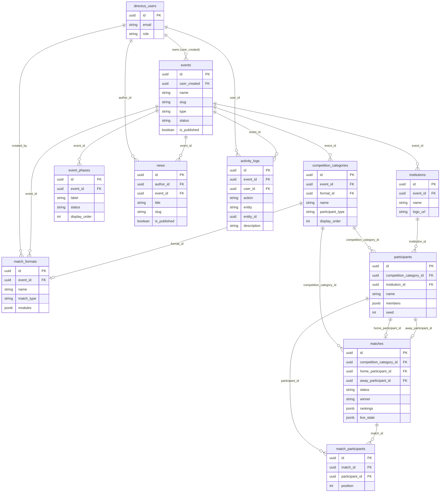

# IPB Lucky Sport & Art — Database & API Schema
> Last updated: 2026-03-20
> For: Backend developer. Self-hosted on VPS. Directus as API layer over PostgreSQL.

---

## Updates

### 2026-03-20
**Replaced `matches.participant_ids JSONB` with `match_participants` junction table.**

Affected sections: 3 (ERD, relasi), 6 (tabel `matches`, tabel baru `match_participants`), 9 (index baru), 10 (debt table), 11 (tidak ada lagi catatan `participant_ids`).

| | Sebelum | Sesudah |
|---|---|---|
| Penyimpanan peserta open match | `matches.participant_ids JSONB` — array UUID tanpa FK | `match_participants(match_id, participant_id, position)` — junction table dengan FK penuh |
| Integritas data | Tidak ada — UUID bisa menunjuk participant yang sudah dihapus | CASCADE pada kedua sisi — junction rows ikut terhapus |
| Query dari frontend | Perlu enrichment fetch terpisah karena Directus tidak bisa expand JSONB | Directus expand otomatis via `fields[]=participants.participant_id.institution.*` |
| Duplikasi peserta | Tidak ada constraint | `UNIQUE(match_id, participant_id)` |

**Yang perlu dilakukan backend:**
1. Buat tabel `match_participants` — DDL ada di Bagian 6
2. Buat dua index baru — ada di Bagian 9
3. Migrasi data lama: ekstrak UUID dari `matches.participant_ids`, insert ke `match_participants` dengan `position` sesuai urutan array
4. Drop kolom `matches.participant_ids`
5. Set permission Directus untuk role `ormawa` dan public pada collection `match_participants` — contoh ada di Bagian 4B

---

---

## 1. Directus untuk developer yang kenal Supabase

Kamu familiar dengan Supabase. Directus konsepnya mirip tapi berbeda implementasinya:

| Konsep | Supabase | Directus |
|---|---|---|
| Auto-generated API | ✅ dari tabel | ✅ dari tabel (disebut "collections") |
| Realtime | Supabase Realtime (Postgres replication) | WebSocket native |
| Auth / JWT | Supabase Auth | Directus Auth (`POST /auth/login`) |
| Row-level security | SQL RLS policies | Directus Permission API (bukan SQL) |
| Edge Functions | Supabase Edge Functions | Directus Flows (lebih sederhana) |
| Dashboard | Supabase Dashboard | Directus Data Studio — **kita tidak pakai ini** |

**Yang penting dipahami:**
- Kamu tidak menulis Express/Fastify routes. Directus auto-generate `GET/POST/PATCH/DELETE /items/{collection}` untuk semua tabel.
- Permission **tidak** dikonfigurasi di SQL. Dikonfigurasi via `PATCH /permissions` API setelah setup.
- Directus punya fitur "revisions" yang menyimpan full snapshot setiap PATCH — **ini harus dimatikan untuk tabel `matches`** atau DB akan penuh (lihat Bagian 6).
- Semua timestamps disimpan sebagai UTC. Tampilan WIB (UTC+7) ditangani di layer frontend/public website.

---

## 2. Arsitektur sistem

```
┌─────────────────────┐     REST PATCH      ┌──────────────────────┐
│   Admin Dashboard   │ ──────────────────► │                      │
│   (custom React)    │                     │   Directus (Node.js) │
└─────────────────────┘                     │   port 8055          │
                                            │                      │
┌─────────────────────┐   WS subscribe      │                      │
│   Public Website    │ ◄────────────────── │                      │
│   (scoreboard, dll) │                     └──────────┬───────────┘
└─────────────────────┘                                │
                                                       │ SQL
                                                       ▼
                                            ┌──────────────────────┐
                                            │   PostgreSQL         │
                                            │   (same VPS)         │
                                            └──────────────────────┘
```

**Pola realtime yang dipakai:**
- **Operator** (admin dashboard) menulis via **REST PATCH** — `PATCH /items/matches/{id}` dengan body `{ "live_state": {...} }`
- **Public display** (scoreboard) membaca via **WebSocket subscription** — terima update otomatis setiap `live_state` berubah

WebSocket subscription message dari public display:
```json
{
  "type": "subscribe",
  "collection": "matches",
  "query": {
    "filter": { "id": { "_eq": "match-uuid-here" } },
    "fields": ["live_state"]
  }
}
```
> Pakai `fields: ["live_state"]` — jangan subscribe ke seluruh row. Ini mencegah broadcast kolom denormalisasi dan metadata setiap detik ke semua viewer.

---

## 3. Struktur data — hierarki dan relasi

### Hierarki kepemilikan data

```
directus_users (ormawa)
└── events
    ├── competition_categories
    │   ├── match_formats         ← format scoring, diassign ke kategori
    │   ├── participants          ← atlet atau tim
    │   │   └── members[]         ← anggota tim (JSONB array, bukan tabel terpisah)
    │   └── matches               ← pertandingan
    │       ├── live_state        ← state real-time (JSONB)
    │       └── match_participants[] ← peserta open match (junction table, bukan JSONB)
    ├── institutions              ← universitas/klub, dipakai oleh participants
    ├── event_phases              ← timeline publik event
    └── news                     ← artikel terkait event

activity_logs                    ← audit trail platform-wide (bukan nested di events)
app_settings                     ← konfigurasi global platform
```

### ERD (Entity Relationship Diagram)



> 💡 Diagram ini render otomatis di GitHub, GitLab, Notion, dan Obsidian.
> Jika perlu render manual: paste ke [mermaid.live](https://mermaid.live)

### Relasi yang perlu diperhatikan

| Relasi | Behavior saat parent dihapus |
|---|---|
| `events` → `competition_categories` | CASCADE — kategori ikut terhapus |
| `events` → `institutions` | CASCADE — institution ikut terhapus |
| `events` → `event_phases` | CASCADE — fase ikut terhapus |
| `events` → `news` | SET NULL — artikel tidak terhapus, `event_id` jadi null |
| `events` → `match_formats` | CASCADE — format ikut terhapus |
| `competition_categories` → `participants` | CASCADE — peserta ikut terhapus |
| `competition_categories` → `matches` | CASCADE — match ikut terhapus |
| `competition_categories` → `match_formats` (via `format_id`) | SET NULL — format tidak terhapus, `format_id` di kategori jadi null |
| `institutions` → `participants` (via `institution_id`) | SET NULL — peserta tidak terhapus, `institution_id` jadi null |
| `participants` → `matches` (via `home/away_participant_id`) | SET NULL — match tidak terhapus, slot peserta jadi null |
| `matches` → `match_participants` | CASCADE — junction rows ikut terhapus |
| `participants` → `match_participants` | CASCADE — junction rows ikut terhapus |

---

## 4. Setup checklist (sebelum production)

Lakukan ini setelah pertama kali deploy Directus:

**A. Buat roles via Directus API:**
```http
POST /roles
{ "name": "ormawa", "app_access": true, "admin_access": false }

POST /roles
{ "name": "superadmin", "app_access": true, "admin_access": true }
```

**B. Set permissions untuk role `ormawa`:**

Ormawa hanya bisa baca/tulis data miliknya sendiri. Untuk setiap collection (`events`, `competition_categories`, `matches`, `participants`, `match_participants`, dll.):
```http
POST /permissions
{
  "role": "<ormawa-role-id>",
  "collection": "events",
  "action": "read",
  "permissions": { "user_created": { "_eq": "$CURRENT_USER" } }
}
```
Ulangi untuk `create`, `update`, `delete` dengan filter yang sama.

Untuk `match_participants`: ormawa bisa baca/tulis junction rows milik match mereka sendiri:
```http
POST /permissions
{
  "role": "<ormawa-role-id>",
  "collection": "match_participants",
  "action": "read",
  "permissions": { "match_id": { "competition_category_id": { "event_id": { "user_created": { "_eq": "$CURRENT_USER" } } } } }
}
```

Untuk `news`: ormawa bisa buat artikel untuk event mereka sendiri:
```http
POST /permissions
{
  "role": "<ormawa-role-id>",
  "collection": "news",
  "action": "create",
  "permissions": {},
  "validation": { "author_id": { "_eq": "$CURRENT_USER" } }
}
```

Public role (tidak login): bisa READ `events`, `matches`, `match_participants`, `news`, `event_phases`, `participants` — tidak bisa write apapun.

**C. ⚠️ KRITIS — Matikan revisions untuk `matches`:**
```http
PATCH /collections/matches
Authorization: Bearer <superadmin_token>
Content-Type: application/json

{ "meta": { "accountability": null } }
```
Juga untuk `activity_logs`:
```http
PATCH /collections/activity_logs
{ "meta": { "accountability": null } }
```

**Kenapa ini kritis:** Directus secara default menyimpan full snapshot setiap row di `directus_revisions` setiap kali ada PATCH. Timer tick = 1 PATCH/detik. Match 2 jam = 7.200 revision rows, masing-masing berisi seluruh `live_state` JSONB. Dengan 10 match live = ~72.000 rows dalam sehari. DB akan timeout.

**D. Set environment variables di VPS:**
```env
KEY=<random-64-char-string>          # JWT signing key
SECRET=<random-64-char-string>       # JWT secret
DB_CLIENT=postgres
DB_HOST=localhost
DB_PORT=5432
DB_DATABASE=ipblucky
DB_USER=directus
DB_PASSWORD=<strong-password>
WEBSOCKETS_ENABLED=true
WEBSOCKETS_HEARTBEAT_PERIOD=60       # detik, jaga koneksi WS tetap hidup
```

---

## 5. Tabel yang dikelola Directus (jangan dibuat di SQL)

| Tabel | Kegunaan |
|---|---|
| `directus_users` | Akun pengguna (ormawa + superadmin) |
| `directus_roles` | Definisi role |
| `directus_permissions` | Rule read/write per role per collection |
| `directus_activity` | Log audit otomatis Directus — kita punya `activity_logs` sendiri |
| `directus_revisions` | Snapshot history — berbahaya untuk `matches`, matikan via langkah C di atas |

---

## 6. Tabel custom kita

> Semua PK pakai UUID — wajib untuk kompatibilitas Directus API.
> Semua tabel butuh trigger `updated_at` kecuali `activity_logs` dan `match_participants` (lihat SQL di Bagian 7).

---

### `events`

```sql
CREATE TABLE events (
  id                    UUID         PRIMARY KEY DEFAULT gen_random_uuid(),
  user_created          UUID         NOT NULL REFERENCES directus_users(id),
  name                  TEXT         NOT NULL,
  slug                  TEXT         NOT NULL UNIQUE,
  -- slug untuk URL publik: "karate-cup-2026", "ipb-futsal-2026"
  -- dibuat otomatis dari name saat event dibuat, bisa diedit
  type                  TEXT         NOT NULL CHECK (type IN ('sport', 'arts')),
  status                TEXT         NOT NULL DEFAULT 'draft'
                                     CHECK (status IN ('draft','upcoming','active','finished','cancelled')),
  start_date            DATE,
  end_date              DATE,
  location              TEXT,
  description           TEXT,
  contact_person        JSONB,
  -- format: { "name": "Gilang", "phone": "081234...", "email": "..." } | null
  registration_url      TEXT,
  guidebook_url         TEXT,
  instagram_url         TEXT,
  website_url           TEXT,
  card_image_url        TEXT,
  banner_image_url      TEXT,        -- null = fallback ke card_image_url di public website
  is_published          BOOLEAN      NOT NULL DEFAULT false,
  is_registration_open  BOOLEAN      NOT NULL DEFAULT false,
  created_at            TIMESTAMPTZ  DEFAULT now(),
  updated_at            TIMESTAMPTZ  DEFAULT now()
);
```

---

### `competition_categories`

Cabang atau divisi dalam sebuah event. Contoh: "Kumite -60kg Putra", "Futsal Putra".

```sql
CREATE TABLE competition_categories (
  id               UUID    PRIMARY KEY DEFAULT gen_random_uuid(),
  event_id         UUID    NOT NULL REFERENCES events(id) ON DELETE CASCADE,
  format_id        UUID    REFERENCES match_formats(id) ON DELETE SET NULL,
  -- nullable: kategori bisa dibuat dulu sebelum format diassign
  name             TEXT    NOT NULL,
  participant_type TEXT    NOT NULL CHECK (participant_type IN ('individual', 'team')),
  display_order    INTEGER NOT NULL DEFAULT 0,
  created_at       TIMESTAMPTZ DEFAULT now(),
  updated_at       TIMESTAMPTZ DEFAULT now()
);
```

**Catatan penting:**
- `name` adalah satu field — tulis label lengkap langsung: "Kumite -60kg Putra", bukan terpisah "Kumite" + "-60kg" + "Putra"
- `format_id` nullable: jika null, match tidak bisa dibuat untuk kategori ini. Frontend harus validasi ini sebelum Allow "Add Match"
- `participant_type` tidak bisa diubah setelah ada peserta terdaftar (frontend validation)

---

### ⚠️ Klarifikasi: `match_type` vs `participant_type`

Ini dua hal berbeda yang sering tertukar:

| Field | Tabel | Artinya |
|---|---|---|
| `match_type` | `match_formats` | Bagaimana satu baris match distrukturkan |
| `participant_type` | `competition_categories` | Apakah peserta adalah individu atau tim |

Keduanya **ortogonal** — semua kombinasi valid:

| Cabang | match_type | participant_type |
|---|---|---|
| Kumite | head_to_head | individual |
| Kata H2H | head_to_head | individual |
| Futsal | head_to_head | team |
| Badminton ganda | head_to_head | team |
| Marathon | open | individual |
| Hackathon | open | team |
| Kata solo (tiap atlet baris sendiri) | solo | individual |

---

### `match_formats`

Mendefinisikan bagaimana pertandingan dinilai. Bisa dipakai ulang di beberapa kategori dalam event yang sama.

```sql
CREATE TABLE match_formats (
  id           UUID    PRIMARY KEY DEFAULT gen_random_uuid(),
  event_id     UUID    NOT NULL REFERENCES events(id) ON DELETE CASCADE,
  -- event_id NOT NULL: format selalu milik satu event. Tidak ada global template.
  -- Jika mau copy format dari event lain, frontend melakukan duplicate (POST item baru).
  name         TEXT    NOT NULL,
  match_type   TEXT    NOT NULL CHECK (match_type IN ('head_to_head', 'solo', 'open')),
  modules      JSONB   NOT NULL CHECK (jsonb_typeof(modules) = 'array'),
  created_by   UUID    REFERENCES directus_users(id),
  created_at   TIMESTAMPTZ DEFAULT now(),
  updated_at   TIMESTAMPTZ DEFAULT now()
);
```

#### Struktur `modules`

Array JSONB. **Elemen pertama selalu scoring engine (tepat satu). Add-on opsional menyusul.**

Urutan ini hanya divalidasi di frontend Format Builder — tidak ada constraint SQL untuk ini.

```json
[
  { "type": "score_timed", "config": { "score_label": "Poin", "has_periods": false } },
  { "type": "timer",       "config": { "mode": "countdown", "duration": 180 } },
  { "type": "notes",       "config": {} }
]
```

#### Config tiap scoring engine

**`score_timed`** — hanya untuk `head_to_head`
```json
{
  "score_label": "Poin",
  "has_periods": false,
  "period_term": "Babak",
  "period_count": 2,
  "period_labels": ["Babak 1", "Babak 2"]
}
```

**`score_sets`** — hanya untuk `head_to_head`
```json
{
  "score_label": "Poin",
  "term": "Set",
  "max_sets": 3,
  "sets_to_win": 2
}
```

**`judge_scores`** — hanya untuk `solo`
```json
{
  "num_judges": 5,
  "score_min": 0,
  "score_max": 10,
  "step": 0.1,
  "method": "avg"
}
```
> `method`: `"avg"` | `"sum"` | `"drop_extremes"` (buang nilai tertinggi dan terendah, rata-rata sisanya)

**`finish_time`** — untuk `solo` dan `open`
```json
{
  "unit": "s",
  "rank_order": "asc"
}
```
> `unit`: `"s"` | `"min"` | `"ms"` | `unit`: `"asc"` = tercepat menang, `"desc"` = terlama menang

**`manual_pick`** — untuk `head_to_head` dan `open`
```json
{
  "allow_draw": false,
  "top_n": 1,
  "ranked_order": true
}
```
> `allow_draw`: hanya untuk `head_to_head`
> `top_n`: berapa posisi yang dicatat (1 = winner only, 3 = podium)
> `ranked_order`: `true` = 1st/2nd/3rd berurutan | `false` = N unranked winners (untuk "lolos/tidak lolos")
> `top_n` dan `ranked_order` hanya relevan untuk `open`

**`timer` (add-on)** — hanya untuk `score_timed` dan `score_sets`
```json
{
  "mode": "countdown",
  "duration": 180
}
```
> `mode`: `"countdown"` = hitung mundur dari durasi | `"stopwatch"` = hitung naik dari 0
> `duration`: dalam detik, diabaikan jika mode = `"stopwatch"`

**`notes` (add-on)** — untuk semua engine
```json
{}
```

#### Matrix kompatibilitas engine × match_type

| Engine | head_to_head | solo | open |
|---|---|---|---|
| `score_timed` | ✅ | | |
| `score_sets` | ✅ | | |
| `judge_scores` | | ✅ | |
| `finish_time` | | ✅ | ✅ |
| `manual_pick` | ✅ | | ✅ |

---

### `institutions`

Universitas, klub, atau sekolah yang mewakili peserta. Dikelola per-event.

```sql
CREATE TABLE institutions (
  id           UUID    PRIMARY KEY DEFAULT gen_random_uuid(),
  event_id     UUID    NOT NULL REFERENCES events(id) ON DELETE CASCADE,
  name         TEXT    NOT NULL,
  logo_url     TEXT,
  created_at   TIMESTAMPTZ DEFAULT now(),
  updated_at   TIMESTAMPTZ DEFAULT now(),

  UNIQUE (event_id, LOWER(name))
  -- Tidak bisa ada dua institution dengan nama yang sama (case-insensitive) dalam satu event
);
```

---

### `participants`

Entitas yang bertanding: atlet (individual) atau tim.

```sql
CREATE TABLE participants (
  id                        UUID    PRIMARY KEY DEFAULT gen_random_uuid(),
  competition_category_id   UUID    NOT NULL REFERENCES competition_categories(id) ON DELETE CASCADE,
  institution_id            UUID    REFERENCES institutions(id) ON DELETE SET NULL,
  name                      TEXT    NOT NULL,
  members                   JSONB,
  -- null untuk individual participant
  -- ["Gilang Muhamad", "Arya Faiz", "Julis Calvin"] untuk tim
  -- tidak ada tabel players terpisah — anggota tim adalah array nama saja
  seed                      INTEGER,   -- untuk bracket di v2; tidak dipakai v1
  notes                     TEXT    DEFAULT '',
  custom_logo_url           TEXT,      -- override logo institution untuk tim ini
  created_at                TIMESTAMPTZ DEFAULT now(),
  updated_at                TIMESTAMPTZ DEFAULT now()
);
```

---

### `matches`

Satu pertandingan dalam suatu kategori.

```sql
CREATE TABLE matches (
  id                        UUID    PRIMARY KEY DEFAULT gen_random_uuid(),
  competition_category_id   UUID    NOT NULL REFERENCES competition_categories(id) ON DELETE CASCADE,
  round                     TEXT,   -- "Babak 16 Besar", "Semifinal", "Final", dll.
  match_name                TEXT,   -- label override opsional, tampil di UI jika diisi
  venue                     TEXT,
  scheduled_at              TIMESTAMPTZ,

  -- Peserta untuk head_to_head dan solo
  home_participant_id       UUID    REFERENCES participants(id) ON DELETE SET NULL,
  away_participant_id       UUID    REFERENCES participants(id) ON DELETE SET NULL,
  CHECK (home_participant_id IS DISTINCT FROM away_participant_id),

  -- Peserta untuk open match: lihat tabel match_participants (junction table)
  -- Tidak ada lagi participant_ids JSONB di sini

  -- Hasil akhir
  winner                    TEXT,
  -- head_to_head: "home" | "away" | "draw"
  -- open manual_pick: nama peserta 1st place (untuk kemudahan query)
  -- Diisi otomatis oleh trigger dari live_state.winner

  rankings                  JSONB,
  -- Untuk open match dengan top_n > 1
  -- Format: [{"rank": 1, "name": "Tim A"}, {"rank": 2, "name": "Tim B"}]
  -- Diisi otomatis oleh trigger dari live_state.rankings
  -- NULL untuk head_to_head dan solo

  -- Kolom denormalisasi — dikelola trigger, JANGAN ditulis langsung dari aplikasi
  home_score                INTEGER  DEFAULT 0,
  away_score                INTEGER  DEFAULT 0,
  timer_secs                INTEGER  DEFAULT 0,

  -- State real-time lengkap — lihat struktur di Bagian 7
  live_state                JSONB    NOT NULL DEFAULT '{}',

  status                    TEXT    NOT NULL DEFAULT 'upcoming'
                                    CHECK (status IN ('upcoming','live','finished','cancelled')),
  created_at                TIMESTAMPTZ DEFAULT now(),
  updated_at                TIMESTAMPTZ DEFAULT now()
);
```

---

### `match_participants`

Junction table untuk peserta open match. Menggantikan `participant_ids JSONB` yang lama.

```sql
CREATE TABLE match_participants (
  id             UUID    PRIMARY KEY DEFAULT gen_random_uuid(),
  match_id       UUID    NOT NULL REFERENCES matches(id) ON DELETE CASCADE,
  participant_id UUID    NOT NULL REFERENCES participants(id) ON DELETE CASCADE,
  position       INTEGER NOT NULL DEFAULT 0,
  -- urutan tampil di UI, bukan ranking hasil — ranking ada di live_state / matches.rankings
  created_at     TIMESTAMPTZ DEFAULT now(),

  UNIQUE (match_id, participant_id)
  -- satu peserta tidak bisa didaftarkan dua kali dalam match yang sama
);
```

**Catatan penting:**
- Tidak ada `updated_at` — junction rows tidak diedit, hanya dihapus dan dibuat ulang jika peserta diganti.
- Tidak ada trigger `updated_at` untuk tabel ini.
- `position` dipakai untuk urutan tampil di UI saja (stacked logos, daftar nama). Hasil pertandingan tetap di `live_state` dan `matches.rankings`.
- Directus otomatis mengekspos ini sebagai relasi M2M pada collection `matches`. Field alias yang dipakai di frontend query: `participants`.

**Directus query untuk open match (frontend):**
```
GET /items/matches
  &fields[]=participants.id
  &fields[]=participants.position
  &fields[]=participants.participant_id.id
  &fields[]=participants.participant_id.name
  &fields[]=participants.participant_id.institution.name
  &fields[]=participants.participant_id.institution.logo_url
  &fields[]=participants.participant_id.institution.color
```

> `participants` adalah alias Directus untuk relasi M2M ke `match_participants`. Setiap item adalah satu junction row: `{ id, position, participant_id: { id, name, institution: { ... } } }`.

---

### `event_phases`

Timeline event yang tampil di website publik.

```sql
CREATE TABLE event_phases (
  id            UUID    PRIMARY KEY DEFAULT gen_random_uuid(),
  event_id      UUID    NOT NULL REFERENCES events(id) ON DELETE CASCADE,
  label         TEXT    NOT NULL,           -- "Pendaftaran Dibuka", "Opening Ceremony", dll.
  description   TEXT    DEFAULT '',
  date_start    DATE    NOT NULL,
  date_end      DATE,                       -- nullable, untuk fase yang punya rentang tanggal
  time_start    TIME    NOT NULL,
  status        TEXT    NOT NULL DEFAULT 'upcoming'
                        CHECK (status IN ('done', 'current', 'upcoming')),
  display_order INTEGER NOT NULL DEFAULT 0  -- urutan tampil di timeline publik
);
```

---

### `news`

Artikel dan pengumuman, bisa per-event atau platform-wide.

```sql
CREATE TABLE news (
  id             UUID    PRIMARY KEY DEFAULT gen_random_uuid(),
  author_id      UUID    NOT NULL REFERENCES directus_users(id),
  event_id       UUID    REFERENCES events(id) ON DELETE SET NULL,
  -- null = pengumuman umum platform, tidak terkait event spesifik
  category       TEXT    NOT NULL CHECK (category IN ('announcement', 'result', 'news', 'update')),
  title          TEXT    NOT NULL,
  slug           TEXT    NOT NULL UNIQUE,
  excerpt        TEXT,
  thumbnail_url  TEXT,
  content        TEXT,                      -- format Markdown
  is_published   BOOLEAN NOT NULL DEFAULT false,
  published_at   TIMESTAMPTZ,
  created_at     TIMESTAMPTZ DEFAULT now(),
  updated_at     TIMESTAMPTZ DEFAULT now()
);
```

---

### `activity_logs`

Audit trail untuk aksi penting. Ditulis eksplisit oleh aplikasi — bukan `directus_activity`.

**Dicatat:** match dimulai/diakhiri/dideklarasi pemenang, peserta ditambah/dihapus, event dibuat/dipublish/diubah status, format dihapus.
**Tidak dicatat:** timer tick, increment skor, perubahan notes.

```sql
CREATE TABLE activity_logs (
  id           UUID    PRIMARY KEY DEFAULT gen_random_uuid(),
  event_id     UUID    REFERENCES events(id) ON DELETE SET NULL,
  -- null untuk aksi level platform (bukan per-event)
  user_id      UUID    NOT NULL REFERENCES directus_users(id),
  action       TEXT    NOT NULL,
  -- 'create' | 'update' | 'delete' | 'publish' | 'unpublish' | 'start' | 'end' | 'declare' | 'cancel'
  entity       TEXT    NOT NULL,
  -- 'match' | 'participant' | 'event' | 'category' | 'format' | 'institution'
  entity_id    UUID,                        -- UUID item yang dikenai aksi
  description  TEXT    NOT NULL,            -- "Started Kumite -60kg Final"
  created_at   TIMESTAMPTZ DEFAULT now()
  -- tidak ada updated_at — log tidak bisa diedit
  -- tidak ada ON DELETE CASCADE ke entity_id — log diretain meski item sudah dihapus
);
```

---

### `app_settings`

Konfigurasi level platform — hal yang perlu bisa diubah tanpa redeploy.

```sql
CREATE TABLE app_settings (
  id             UUID    PRIMARY KEY DEFAULT gen_random_uuid(),
  setting_key    TEXT    NOT NULL UNIQUE,
  setting_value  TEXT,
  description    TEXT,
  updated_at     TIMESTAMPTZ DEFAULT now()
);
```

| setting_key | Contoh nilai | Keterangan |
|---|---|---|
| `site_name` | IPB Lucky Sports & Arts | Nama di browser tab dan header publik |
| `default_locale` | id | Bahasa default website publik |
| `public_base_url` | https://sport.ipb.ac.id | Untuk generate share link |
| `registration_default_open` | false | Default `is_registration_open` untuk event baru |

---

## 7. Struktur `live_state`

Objek JSONB flat di kolom `matches.live_state`. Single source of truth untuk UI operator dan public scoreboard.

Hanya field yang relevan dengan engine aktif yang terisi — sisanya tetap ada di objek dengan nilai default.

```json
{
  "matchStatus": "upcoming | live | finished",
  "winner": null,
  "rankings": [],
  "notes": "",

  "timerSecs": 180,          // snapshot value at last operator interaction
  "timerLastStarted": null,  // ISO 8601 UTC — set on Start, cleared on Stop/Reset/Set
  "timerRunning": false,
  "timerFlags": [],

  "homeScore": 0,
  "awayScore": 0,
  "periodIdx": 0,
  "periodPhase": "idle | active | halftime",

  "setIdx": 0,
  "setPhase": "idle | active | ending",
  "setScore": [0, 0],
  "setsWon": [0, 0],
  "setLog": [],
  "pendingSetWinner": null,

  "judgeScores": [],
  "timeLog": []
}
```

**Detail tiap field:**

| Field | Engine | Keterangan |
|---|---|---|
| `matchStatus` | semua | Status match saat ini |
| `winner` | semua | Hasil — diisi saat match selesai, trigger sync ke kolom `matches.winner` |
| `rankings` | manual_pick open | `[{ "rank": 1, "id": "uuid", "name": "Tim A" }]` — trigger sync ke `matches.rankings` |
| `notes` | notes add-on | Catatan operator, bisa di-broadcast ke public display |
| `timerSecs` | timer add-on | Snapshot nilai timer saat operator terakhir berinteraksi (bukan nilai live) |
| `timerLastStarted` | timer add-on | ISO timestamp saat Start terakhir ditekan. Null jika berhenti. Dipakai client untuk rekonstruksi nilai live: `elapsed = now - timerLastStarted` |
| `timerRunning` | timer add-on | Apakah timer sedang berjalan |
| `timerFlags` | timer add-on | `[{ "label": "Flag 1", "secs": 142.5 }]` — secs dihitung saat flag ditekan |
| `homeScore` / `awayScore` | score_timed | Skor yang terus bertambah, tidak pernah reset |
| `periodIdx` | score_timed | Index babak saat ini (0-based) |
| `periodPhase` | score_timed | Status babak |
| `setIdx` | score_sets | Index set saat ini |
| `setPhase` | score_sets | Status set saat ini |
| `setScore` | score_sets | Skor set yang sedang berjalan, reset ke [0,0] setiap set baru |
| `setsWon` | score_sets | Jumlah set yang sudah dimenangkan: [home, away] |
| `setLog` | score_sets | History set selesai: `[{ "label": "Set 1", "home": 21, "away": 18, "winner": "home" }]` |
| `pendingSetWinner` | score_sets | Pemenang set yang menunggu konfirmasi operator |
| `judgeScores` | judge_scores | Nilai per juri: `[7.5, 8.2, 7.8, ...]` |
| `timeLog` | finish_time | Finish time per peserta: `[{ "name": "Reza", "time": "10:42.3" }]` |

**Yang tidak ada di live_state:**
- `_ftName` / `_ftTime` — ini UI state di frontend saja, jangan ditulis ke DB

---

## 8. SQL: Trigger dan functions

### Trigger denormalisasi `matches`

Berjalan setiap kali `matches` di-UPDATE. Mengekstrak nilai dari `live_state` ke kolom denormalisasi.

```sql
CREATE OR REPLACE FUNCTION sync_match_denorm()
RETURNS trigger AS $$
BEGIN
  NEW.home_score  := COALESCE((NEW.live_state->>'homeScore')::int, 0);
  NEW.away_score  := COALESCE((NEW.live_state->>'awayScore')::int, 0);
  NEW.timer_secs  := COALESCE((NEW.live_state->>'timerSecs')::int, 0);
  NEW.winner      := NEW.live_state->>'winner';
  NEW.rankings    := CASE
    WHEN NEW.live_state ? 'rankings'
     AND jsonb_array_length(NEW.live_state->'rankings') > 0
    THEN NEW.live_state->'rankings'
    ELSE NULL
  END;
  RETURN NEW;
END;
$$ LANGUAGE plpgsql;

CREATE TRIGGER trg_match_denorm
  BEFORE UPDATE ON matches
  FOR EACH ROW EXECUTE FUNCTION sync_match_denorm();
```

> **Penting:** Trigger ini hanya sinkronisasi dari `live_state`. Kolom `status` di `matches` tetap harus di-PATCH eksplisit oleh aplikasi saat match selesai — trigger tidak mengubah `status`.

### Trigger `updated_at`

```sql
CREATE OR REPLACE FUNCTION set_updated_at()
RETURNS trigger AS $$
BEGIN
  NEW.updated_at = now();
  RETURN NEW;
END;
$$ LANGUAGE plpgsql;
```

Terapkan ke semua tabel yang punya `updated_at`:
```sql
CREATE TRIGGER trg_updated_at BEFORE UPDATE ON events
  FOR EACH ROW EXECUTE FUNCTION set_updated_at();
CREATE TRIGGER trg_updated_at BEFORE UPDATE ON competition_categories
  FOR EACH ROW EXECUTE FUNCTION set_updated_at();
CREATE TRIGGER trg_updated_at BEFORE UPDATE ON match_formats
  FOR EACH ROW EXECUTE FUNCTION set_updated_at();
CREATE TRIGGER trg_updated_at BEFORE UPDATE ON institutions
  FOR EACH ROW EXECUTE FUNCTION set_updated_at();
CREATE TRIGGER trg_updated_at BEFORE UPDATE ON participants
  FOR EACH ROW EXECUTE FUNCTION set_updated_at();
CREATE TRIGGER trg_updated_at BEFORE UPDATE ON matches
  FOR EACH ROW EXECUTE FUNCTION set_updated_at();
CREATE TRIGGER trg_updated_at BEFORE UPDATE ON news
  FOR EACH ROW EXECUTE FUNCTION set_updated_at();
CREATE TRIGGER trg_updated_at BEFORE UPDATE ON app_settings
  FOR EACH ROW EXECUTE FUNCTION set_updated_at();
-- match_participants tidak punya updated_at — tidak perlu trigger
```

---

## 9. Index

```sql
-- events
CREATE INDEX idx_events_user_created      ON events(user_created);
CREATE INDEX idx_events_status            ON events(status);
CREATE UNIQUE INDEX idx_events_slug       ON events(slug);

-- competition_categories
CREATE INDEX idx_categories_event         ON competition_categories(event_id);

-- match_formats
CREATE INDEX idx_formats_event            ON match_formats(event_id);

-- institutions
CREATE UNIQUE INDEX idx_inst_event_name   ON institutions(event_id, LOWER(name));

-- participants
CREATE INDEX idx_participants_category    ON participants(competition_category_id);
CREATE INDEX idx_participants_institution ON participants(institution_id);

-- matches
CREATE INDEX idx_matches_category         ON matches(competition_category_id);
CREATE INDEX idx_matches_status           ON matches(status);
CREATE INDEX idx_matches_scheduled        ON matches(scheduled_at);
CREATE INDEX idx_matches_home             ON matches(home_participant_id)
  WHERE home_participant_id IS NOT NULL;
CREATE INDEX idx_matches_away             ON matches(away_participant_id)
  WHERE away_participant_id IS NOT NULL;
CREATE INDEX idx_matches_winner           ON matches(winner)
  WHERE winner IS NOT NULL;
CREATE INDEX idx_matches_rankings         ON matches USING GIN (rankings)
  WHERE rankings IS NOT NULL;

-- match_participants
CREATE INDEX idx_match_participants_match       ON match_participants(match_id);
CREATE INDEX idx_match_participants_participant ON match_participants(participant_id);

-- news
CREATE UNIQUE INDEX idx_news_slug         ON news(slug);
CREATE INDEX idx_news_event               ON news(event_id)
  WHERE event_id IS NOT NULL;
CREATE INDEX idx_news_published           ON news(is_published, published_at);

-- activity_logs
CREATE INDEX idx_logs_event               ON activity_logs(event_id)
  WHERE event_id IS NOT NULL;
CREATE INDEX idx_logs_user                ON activity_logs(user_id);
CREATE INDEX idx_logs_entity              ON activity_logs(entity, entity_id)
  WHERE entity_id IS NOT NULL;
CREATE INDEX idx_logs_created             ON activity_logs(created_at DESC);
```

---

## 10. Utang teknis v1 → v2

| Item | Kondisi v1 | Status |
|---|---|---|
| `matches.participant_ids JSONB` | Array UUID tanpa FK constraint | ✅ **Selesai** — diganti `match_participants` junction table |
| Timer tick di browser | **Fixed** — timer kini pakai snapshot + `timerLastStarted`. Client merekonstruksi nilai saat mount. Refresh tidak lagi mereset tampilan. | ✅ Selesai |
| `winner TEXT` semantik ganda | String berbeda arti per match_type | Split: `winner_participant_id UUID REFERENCES participants` untuk h2h/solo; `rankings` JSONB untuk open |
| `seed` tersimpan tapi hidden | Bracket logic belum dibangun | Tampilkan dan aktifkan saat fitur bracket v2 |
| Media = Google Drive URL | Bukan proper storage | S3-compatible storage atau Directus Files |
| `finish_time` results ke `rankings` | Aplikasi harus manually populate `live_state.rankings` dari `timeLog` sebelum close match agar trigger bisa sync | Buat Directus Flow yang otomatis melakukan ini saat `status` di-set ke `finished` |

---

## 11. Catatan implementasi penting

### `finish_time` dan kolom `rankings`
Trigger `sync_match_denorm` mengisi `matches.rankings` dari `live_state.rankings`. Tapi engine `finish_time` menyimpan data di `live_state.timeLog`, bukan `live_state.rankings`.

**Konsekuensi:** `matches.rankings` selalu NULL untuk match `finish_time` kecuali aplikasi secara eksplisit menulis `live_state.rankings` berdasarkan urutan `timeLog` sebelum menutup match.

Ini tanggung jawab aplikasi (frontend match control), bukan trigger.

### Timer tidak PATCH setiap detik — snapshot + elapsed

`timerSecs` adalah snapshot nilai saat operator terakhir berinteraksi. Display value dihitung client-side:

```js
function calcCurrentSecs(live, timerCfg) {
  const isStop   = timerCfg?.mode === "stopwatch";
  const snapshot = Math.max(0, live.timerSecs ?? 0);
  if (!live.timerRunning || !live.timerLastStarted) return snapshot;
  const elapsed  = Math.max(0, (Date.now() - new Date(live.timerLastStarted).getTime()) / 1000);
  return isStop ? snapshot + elapsed : Math.max(0, snapshot - elapsed);
}
```

**DB write hanya saat operator menekan tombol:**

| Aksi | Yang di-PATCH |
|---|---|
| Start | `{ timerRunning: true, timerLastStarted: now(), timerSecs: calcCurrentSecs() }` |
| Stop | `{ timerRunning: false, timerSecs: calcCurrentSecs(), timerLastStarted: null }` |
| Reset | `{ timerRunning: false, timerSecs: initSecs, timerLastStarted: null, timerFlags: [] }` |
| Set (manual) | `{ timerRunning: false, timerSecs: newVal, timerLastStarted: null }` |
| Flag | `{ timerFlags: [...flags, { label, secs: calcCurrentSecs() }] }` |
| End Match | Sertakan `timerRunning: false, timerSecs: calcCurrentSecs(), timerLastStarted: null` dalam patch yang sama |

Public display merekonstruksi nilai timer dari snapshot + elapsed secara lokal — tidak perlu stream setiap detik. Ini mengeliminasi ~7.200 writes/jam per match live.

**Edge cases yang wajib dihandle di client:**
- `timerLastStarted` null tapi `timerRunning: true` → korup, treat as stopped
- `elapsed > timerSecs` (countdown kehabisan sebelum dihandle) → clamp ke 0, PATCH stop
- `timerLastStarted` di masa depan (clock skew) → elapsed negatif, clamp ke 0
- `timerSecs` negatif → clamp ke 0
- Start countdown yang sudah di 0 → block (disable button)
- Double-click Start → debounce 500ms

### Jangan PATCH `live_state` pada setiap keystroke
Setiap PATCH = 1 write ke Postgres + broadcast WebSocket ke semua subscriber. Field `_ftName`/`_ftTime` adalah UI state — simpan di React state, bukan DB. Hanya PATCH `live_state` ketika operator menekan "Log Time".

### Warning sebelum edit format yang sedang live
Format bisa diassign ke beberapa kategori. Jika format diedit saat ada match `status = 'live'` yang menggunakannya, operator screen match tersebut akan berubah mid-match. Aplikasi harus cek ini dan tampilkan warning.

### Redis untuk multi-instance
Jika di masa depan butuh lebih dari satu instance Directus (scaling), WebSocket memerlukan Redis sebagai shared pubsub backend. Set `REDIS=redis://localhost:6379` di env. Untuk satu VPS ini tidak perlu.

### Timezone
Semua data waktu disimpan UTC di Postgres. Display WIB (UTC+7) ditangani di layer frontend/public website — bukan di DB.