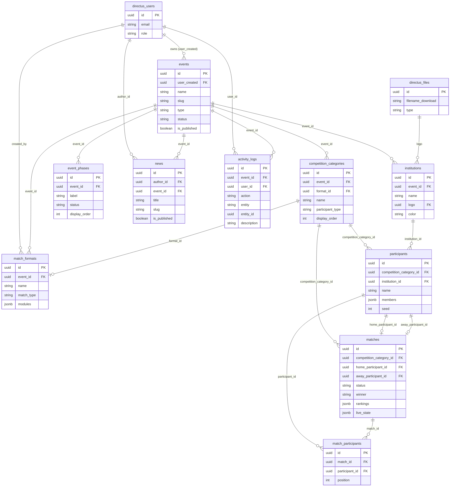

# IPB Lucky Sport & Art — Database & API Schema
> Last updated: 2026-04-05
> For: Backend developer. Self-hosted on VPS. Directus as API layer over PostgreSQL.

---

## Updates

### 2026-04-17

**Penambahan mode `deadline` pada module `timer`**
Untuk event yang berlangsung lama (seperti Hackathon atau Game Jam), module `timer` sekarang mendukung `mode: "deadline"`. Alih-alih menghitung detik dari backend, module ini membaca `timerTarget` (ISO Timestamp) dari `live_state` JSON dan frontend akan menghitung mundur sisa hari/jam/menit secara pasif. Tidak ada perubahan struktur tabel DB, semua murni via JSON `live_state`.

---

### 2026-04-05

**Koreksi field `logo` pada tabel `institutions` dan semua query yang mereferensikannya.**

1. **`institutions` DDL — koreksi field `logo`**
   Field ini bukan `logo_url TEXT` (plain URL), melainkan Directus file asset field bertipe `UUID` yang mereferensikan `directus_files`. Di Directus UI field ini tampil sebagai image picker. ERD dan DDL diupdate untuk mencerminkan ini.

2. **Field query participants — `institution_id.*` bukan `institution.*`**
   Karena nama kolom FK di tabel `participants` adalah `institution_id`, Directus mengekspos relasi ini dengan key `institution_id`, bukan `institution`. Semua contoh query diupdate:
   - `institution.logo_url` → `institution_id.logo`
   - `institution.name` → `institution_id.name`
   - `institution.*` → `institution_id.*`

3. **`getAssetUrl` wajib dipakai untuk render logo**
   `institution_id.logo` mengembalikan UUID file, bukan URL langsung. Di layer frontend, UUID ini harus dikonversi dulu: `getAssetUrl(institution.logo)` → `http://<host>/assets/<uuid>`. Catatan ditambahkan di Bagian 6 dan Bagian 11.

4. **Mapping di `getMatches` (directus.js)**
   Karena Directus mengembalikan `institution_id` sebagai key, mapping eksplisit diperlukan untuk menyediakan `institution.logo_url` yang dibaca komponen frontend:
   ```js
   const mapParticipant = (p) => p ? {
     ...p,
     institution: p.institution_id ? {
       ...p.institution_id,
       logo_url: getAssetUrl(p.institution_id?.logo),
     } : null,
   } : null;
   ```

---

### 2026-03-30

**Beberapa koreksi dari review seed data dan konsistensi schema.**

1. **`institutions` DDL — tambah kolom `color TEXT`**
   Kolom ini sudah direferensikan di contoh Directus query (`institution.color`) tapi belum ada di DDL. Ditambahkan sekarang di Bagian 6.

2. **`directus_users` — dokumentasi custom field `organisation_name`**
   Field ini ditambahkan via Directus UI dan dipakai oleh seed (`UPDATE directus_users SET organisation_name = 'IWDC'`). Sekarang didokumentasikan di Bagian 5.

3. **Trigger denormalisasi hanya jalan saat UPDATE, bukan INSERT**
   `trg_match_denorm` tidak akan mengisi kolom `winner`, `home_score`, `away_score` pada INSERT awal. Seed data perlu menjalankan UPDATE eksplisit setelah INSERT agar kolom denormalisasi terisi. Catatan ditambahkan di Bagian 8.

4. **`live_state` timer untuk open match tanpa timer module**
   Format `manual_pick`-only (misal hackathon) tidak punya `timer` add-on. Field `timerSecs`, `timerRunning`, `timerLastStarted` di `live_state` match tersebut adalah dead data — frontend tidak merender timer, engine tidak membacanya. Best practice: jangan tulis field timer ke `live_state` untuk match yang formatnya tidak punya `timer` module.

5. **Directus permissions API sekarang pakai `policy`, bukan `role`**
   Versi Directus terbaru mengganti sistem roles dengan policies. Endpoint `POST /permissions` sekarang membutuhkan field `policy` (UUID) — field `role` tidak lagi diterima. Bagian 4 diupdate untuk mencerminkan ini. Permission public untuk `organisation_name` kini otomatis diinsert oleh seed script.

---

### 2026-03-20
**Replaced `matches.participant_ids JSONB` with `match_participants` junction table.**

| | Sebelum | Sesudah |
|---|---|---|
| Penyimpanan peserta open match | `matches.participant_ids JSONB` — array UUID tanpa FK | `match_participants(match_id, participant_id, position)` — junction table dengan FK penuh |
| Integritas data | Tidak ada — UUID bisa menunjuk participant yang sudah dihapus | CASCADE pada kedua sisi — junction rows ikut terhapus |
| Query dari frontend | Perlu enrichment fetch terpisah karena Directus tidak bisa expand JSONB | Directus expand otomatis via `fields[]=participants.participant_id.institution_id.*` |
| Duplikasi peserta | Tidak ada constraint | `UNIQUE(match_id, participant_id)` |

---

## 1. Directus untuk developer yang kenal Supabase

Kamu familiar dengan Supabase. Directus konsepnya mirip tapi berbeda implementasinya:

| Konsep | Supabase | Directus |
|---|---|---|
| Auto-generated API | ✅ dari tabel | ✅ dari tabel (disebut "collections") |
| Realtime | Supabase Realtime (Postgres replication) | WebSocket native |
| Auth / JWT | Supabase Auth | Directus Auth (`POST /auth/login`) |
| Row-level security | SQL RLS policies | Directus Permission API (bukan SQL) |
| Edge Functions | Supabase Edge Functions | Directus Flows (lebih sederhana) |
| Dashboard | Supabase Dashboard | Directus Data Studio — **kita tidak pakai ini** |

**Yang penting dipahami:**
- Kamu tidak menulis Express/Fastify routes. Directus auto-generate `GET/POST/PATCH/DELETE /items/{collection}` untuk semua tabel.
- Permission **tidak** dikonfigurasi di SQL. Dikonfigurasi via `PATCH /permissions` API setelah setup.
- Directus punya fitur "revisions" yang menyimpan full snapshot setiap PATCH — **ini harus dimatikan untuk tabel `matches`** atau DB akan penuh (lihat Bagian 6).
- Semua timestamps disimpan sebagai UTC. Tampilan WIB (UTC+7) ditangani di layer frontend/public website.
- **Directus mengekspos relasi FK dengan nama kolom aslinya.** Jika kolom FK bernama `institution_id`, maka key yang dikembalikan API juga `institution_id`, bukan `institution`. Perhatikan ini saat menulis field queries.

---

## 2. Arsitektur sistem

```
┌─────────────────────┐     REST PATCH      ┌──────────────────────┐
│   Admin Dashboard   │ ──────────────────► │                      │
│   (custom React)    │                     │   Directus (Node.js) │
└─────────────────────┘                     │   port 6767          │
                                            │                      │
┌─────────────────────┐   WS subscribe      │                      │
│   Public Website    │ ◄────────────────── │                      │
│   (scoreboard, dll) │                     └──────────┬───────────┘
└─────────────────────┘                                │
                                                       │ SQL
                                                       ▼
                                            ┌──────────────────────┐
                                            │   PostgreSQL         │
                                            │   (same VPS)         │
                                            └──────────────────────┘
```

**Pola realtime yang dipakai:**
- **Operator** (admin dashboard) menulis via **REST PATCH** — `PATCH /items/matches/{id}` dengan body `{ "live_state": {...} }`
- **Public display** (scoreboard) membaca via **WebSocket subscription** — terima update otomatis setiap `live_state` berubah

WebSocket subscription message dari public display:
```json
{
  "type": "subscribe",
  "collection": "matches",
  "query": {
    "filter": { "id": { "_eq": "match-uuid-here" } },
    "fields": ["live_state"]
  }
}
```
> Pakai `fields: ["live_state"]` — jangan subscribe ke seluruh row. Ini mencegah broadcast kolom denormalisasi dan metadata setiap detik ke semua viewer.

---

## 3. Struktur data — hierarki dan relasi

### Hierarki kepemilikan data

```
directus_users (ormawa)
└── events
    ├── competition_categories
    │   ├── match_formats         ← format scoring, diassign ke kategori
    │   ├── participants          ← atlet atau tim
    │   │   └── members[]         ← anggota tim (JSONB array, bukan tabel terpisah)
    │   └── matches               ← pertandingan
    │       ├── live_state        ← state real-time (JSONB)
    │       └── match_participants[] ← peserta open match (junction table)
    ├── institutions              ← universitas/klub, dipakai oleh participants
    ├── event_phases              ← timeline publik event
    └── news                     ← artikel terkait event

activity_logs                    ← audit trail platform-wide (bukan nested di events)
app_settings                     ← konfigurasi global platform
```

### ERD (Entity Relationship Diagram)



### Relasi yang perlu diperhatikan

| Relasi | Behavior saat parent dihapus |
|---|---|
| `events` → `competition_categories` | CASCADE — kategori ikut terhapus |
| `events` → `institutions` | CASCADE — institution ikut terhapus |
| `events` → `event_phases` | CASCADE — fase ikut terhapus |
| `events` → `news` | SET NULL — artikel tidak terhapus, `event_id` jadi null |
| `events` → `match_formats` | CASCADE — format ikut terhapus |
| `competition_categories` → `participants` | CASCADE — peserta ikut terhapus |
| `competition_categories` → `matches` | CASCADE — match ikut terhapus |
| `competition_categories` → `match_formats` (via `format_id`) | SET NULL — format tidak terhapus, `format_id` di kategori jadi null |
| `institutions` → `participants` (via `institution_id`) | SET NULL — peserta tidak terhapus, `institution_id` jadi null |
| `participants` → `matches` (via `home/away_participant_id`) | SET NULL — match tidak terhapus, slot peserta jadi null |
| `matches` → `match_participants` | CASCADE — junction rows ikut terhapus |
| `participants` → `match_participants` | CASCADE — junction rows ikut terhapus |
| `directus_files` → `institutions` (via `logo`) | SET NULL — institution tidak terhapus, `logo` jadi null |

---

## 4. Setup checklist (sebelum production)

Lakukan ini setelah pertama kali deploy Directus:

> ⚠️ **Directus versi terbaru pakai `policies`, bukan `roles`, untuk permission.**
> Endpoint `/permissions` sekarang membutuhkan field `policy` (UUID), bukan `role`. Untuk mendapatkan UUID policy yang diinginkan:
> ```bash
> curl http://localhost:6767/policies -H "Authorization: Bearer <token>"
> ```
> Cari object dengan `name` yang sesuai — public policy punya `name: "$t:public_label"`.

**A. Buat policies via Directus API:**
```http
POST /policies
{ "name": "ormawa", "app_access": true, "admin_access": false }

POST /policies
{ "name": "superadmin", "app_access": true, "admin_access": true }
```

**B. Set permissions untuk policy `ormawa`:**

Ormawa hanya bisa baca/tulis data miliknya sendiri. Untuk setiap collection (`events`, `competition_categories`, `matches`, `participants`, `match_participants`, dll.):
```http
POST /permissions
{
  "policy": "<ormawa-policy-id>",
  "collection": "events",
  "action": "read",
  "permissions": { "user_created": { "_eq": "$CURRENT_USER" } }
}
```
Ulangi untuk `create`, `update`, `delete` dengan filter yang sama.

Untuk `match_participants`: ormawa bisa baca/tulis junction rows milik match mereka sendiri:
```http
POST /permissions
{
  "policy": "<ormawa-policy-id>",
  "collection": "match_participants",
  "action": "read",
  "permissions": { "match_id": { "competition_category_id": { "event_id": { "user_created": { "_eq": "$CURRENT_USER" } } } } }
}
```

Untuk `news`: ormawa bisa buat artikel untuk event mereka sendiri:
```http
POST /permissions
{
  "policy": "<ormawa-policy-id>",
  "collection": "news",
  "action": "create",
  "permissions": {},
  "validation": { "author_id": { "_eq": "$CURRENT_USER" } }
}
```

Public policy (tidak login): bisa READ `events`, `matches`, `match_participants`, `news`, `event_phases`, `participants`, `institutions` — tidak bisa write apapun.

> ✅ **Permission `directus_users.organisation_name` untuk public sudah ditangani oleh seed script** — tidak perlu setup manual.

**C. ⚠️ KRITIS — Matikan revisions untuk `matches`:**
```http
PATCH /collections/matches
Authorization: Bearer <superadmin_token>
Content-Type: application/json

{ "meta": { "accountability": null } }
```
Juga untuk `activity_logs`:
```http
PATCH /collections/activity_logs
{ "meta": { "accountability": null } }
```

**Kenapa ini kritis:** Directus secara default menyimpan full snapshot setiap row di `directus_revisions` setiap kali ada PATCH. Timer tick = 1 PATCH/detik. Match 2 jam = 7.200 revision rows, masing-masing berisi seluruh `live_state` JSONB. Dengan 10 match live = ~72.000 rows dalam sehari. DB akan timeout.

**D. Set environment variables di VPS:**
```env
KEY=<random-64-char-string>
SECRET=<random-64-char-string>
DB_CLIENT=postgres
DB_HOST=localhost
DB_PORT=5432
DB_DATABASE=ipblucky
DB_USER=directus
DB_PASSWORD=<strong-password>
WEBSOCKETS_ENABLED=true
WEBSOCKETS_HEARTBEAT_PERIOD=60
```

---

## 5. Tabel yang dikelola Directus (jangan dibuat di SQL)

| Tabel | Kegunaan |
|---|---|
| `directus_users` | Akun pengguna (ormawa + superadmin). Custom field `organisation_name TEXT` ditambahkan via Directus UI — menyimpan nama organisasi/UKM penyelenggara (contoh: "IWDC", "Karate IPB"). |
| `directus_files` | File asset storage. Logo institution disimpan di sini — field `institutions.logo` adalah FK ke `directus_files.id`. Untuk render URL: `GET /assets/<file-id>`. |
| `directus_roles` | Definisi role |
| `directus_permissions` | Rule read/write per policy per collection |
| `directus_activity` | Log audit otomatis Directus — kita punya `activity_logs` sendiri |
| `directus_revisions` | Snapshot history — berbahaya untuk `matches`, matikan via langkah C di atas |

---

## 6. Tabel custom kita

> Semua PK pakai UUID — wajib untuk kompatibilitas Directus API.
> Semua tabel butuh trigger `updated_at` kecuali `activity_logs` dan `match_participants` (lihat SQL di Bagian 7).

---

### `events`

```sql
CREATE TABLE events (
  id                    UUID         PRIMARY KEY DEFAULT gen_random_uuid(),
  user_created          UUID         NOT NULL REFERENCES directus_users(id),
  name                  TEXT         NOT NULL,
  slug                  TEXT         NOT NULL UNIQUE,
  type                  TEXT         NOT NULL CHECK (type IN ('sport', 'arts')),
  status                TEXT         NOT NULL DEFAULT 'draft'
                                     CHECK (status IN ('draft','upcoming','active','finished','cancelled')),
  start_date            DATE,
  end_date              DATE,
  location              TEXT,
  description           TEXT,
  contact_person        JSONB,
  registration_url      TEXT,
  guidebook_url         TEXT,
  instagram_url         TEXT,
  website_url           TEXT,
  card_image            UUID         REFERENCES directus_files(id) ON DELETE SET NULL,
  banner_image          UUID         REFERENCES directus_files(id) ON DELETE SET NULL,
  is_published          BOOLEAN      NOT NULL DEFAULT false,
  is_registration_open  BOOLEAN      NOT NULL DEFAULT false,
  registration_end_date TIMESTAMPTZ,
  created_at            TIMESTAMPTZ  DEFAULT now(),
  updated_at            TIMESTAMPTZ  DEFAULT now()
);
```

---

### `competition_categories`

```sql
CREATE TABLE competition_categories (
  id               UUID    PRIMARY KEY DEFAULT gen_random_uuid(),
  event_id         UUID    NOT NULL REFERENCES events(id) ON DELETE CASCADE,
  format_id        UUID    REFERENCES match_formats(id) ON DELETE SET NULL,
  name             TEXT    NOT NULL,
  participant_type TEXT    NOT NULL CHECK (participant_type IN ('individual', 'team')),
  display_order    INTEGER NOT NULL DEFAULT 0,
  created_at       TIMESTAMPTZ DEFAULT now(),
  updated_at       TIMESTAMPTZ DEFAULT now()
);
```

---

### ⚠️ Klarifikasi: `match_type` vs `participant_type`

| Field | Tabel | Artinya |
|---|---|---|
| `match_type` | `match_formats` | Bagaimana satu baris match distrukturkan |
| `participant_type` | `competition_categories` | Apakah peserta adalah individu atau tim |

| Cabang | match_type | participant_type |
|---|---|---|
| Kumite | head_to_head | individual |
| Kata H2H | head_to_head | individual |
| Futsal | head_to_head | team |
| Marathon | open | individual |
| Hackathon | open | team |
| Kata solo | solo | individual |

---

### `match_formats`

```sql
CREATE TABLE match_formats (
  id           UUID    PRIMARY KEY DEFAULT gen_random_uuid(),
  event_id     UUID    NOT NULL REFERENCES events(id) ON DELETE CASCADE,
  name         TEXT    NOT NULL,
  match_type   TEXT    NOT NULL CHECK (match_type IN ('head_to_head', 'solo', 'open')),
  modules      JSONB   NOT NULL CHECK (jsonb_typeof(modules) = 'array'),
  created_by   UUID    REFERENCES directus_users(id),
  created_at   TIMESTAMPTZ DEFAULT now(),
  updated_at   TIMESTAMPTZ DEFAULT now()
);
```

#### Struktur `modules`

Array JSONB. Elemen pertama selalu scoring engine (tepat satu). Add-on opsional menyusul.

```json
[
  { "type": "score_timed", "config": { "score_label": "Poin", "has_periods": false } },
  { "type": "timer",       "config": { "mode": "countdown", "duration": 180 } },
  { "type": "notes",       "config": {} }
]
```

#### Config tiap scoring engine

**`score_timed`** — hanya untuk `head_to_head`
```json
{ "score_label": "Poin", "has_periods": false, "period_term": "Babak", "period_count": 2 }
```

**`score_sets`** — hanya untuk `head_to_head`
```json
{ "score_label": "Poin", "term": "Set", "max_sets": 3, "sets_to_win": 2 }
```

**`judge_scores`** — hanya untuk `solo`
```json
{ "num_judges": 5, "score_min": 0, "score_max": 10, "step": 0.1, "method": "avg" }
```
> `method`: `"avg"` | `"sum"` | `"drop_extremes"`

**`finish_time`** — untuk `solo` dan `open`
```json
{ "unit": "s", "rank_order": "asc" }
```

**`manual_pick`** — untuk `head_to_head` dan `open`
```json
{ "allow_draw": false, "top_n": 1, "ranked_order": true }
```

**`timer` (add-on)** — hanya untuk `score_timed`, `score_sets`, `finish_time`, dan `open`
```json
{ "mode": "countdown | stopwatch | deadline", "duration": 180 } // Catatan: duration diabaikan jika mode adalah deadline.
```

**`notes` (add-on)** — untuk semua engine
```json
{}
```

#### Matrix kompatibilitas engine × match_type

| Engine | head_to_head | solo | open |
|---|---|---|---|
| `score_timed` | ✅ | | |
| `score_sets` | ✅ | | |
| `judge_scores` | | ✅ | |
| `finish_time` | | ✅ | ✅ |
| `manual_pick` | ✅ | | ✅ |

---

### `institutions`

```sql
CREATE TABLE institutions (
  id           UUID    PRIMARY KEY DEFAULT gen_random_uuid(),
  event_id     UUID    NOT NULL REFERENCES events(id) ON DELETE CASCADE,
  name         TEXT    NOT NULL,
  logo         UUID    REFERENCES directus_files(id) ON DELETE SET NULL,
  -- File asset dikelola Directus. Untuk render: GET /assets/<logo-uuid>
  -- Di frontend: getAssetUrl(institution.logo) → full URL
  color        TEXT,
  -- Format hex: "#1A3D6E". null = fallback ke warna default tema.
  created_at   TIMESTAMPTZ DEFAULT now(),
  updated_at   TIMESTAMPTZ DEFAULT now(),

  UNIQUE (event_id, LOWER(name))
);
```

> **⚠️ Penting untuk frontend:** Field `logo` mengembalikan UUID, bukan URL. Selalu konversi dengan `getAssetUrl(institution.logo)` sebelum dipakai sebagai `src` di ``. Jangan asumsikan field ini adalah URL siap pakai.

---

### `participants`

```sql
CREATE TABLE participants (
  id                        UUID    PRIMARY KEY DEFAULT gen_random_uuid(),
  competition_category_id   UUID    NOT NULL REFERENCES competition_categories(id) ON DELETE CASCADE,
  institution_id            UUID    REFERENCES institutions(id) ON DELETE SET NULL,
  name                      TEXT    NOT NULL,
  members                   JSONB,
  seed                      INTEGER,
  notes                     TEXT    DEFAULT '',
  custom_logo_url           TEXT,
  created_at                TIMESTAMPTZ DEFAULT now(),
  updated_at                TIMESTAMPTZ DEFAULT now()
);
```

> **⚠️ Nama kolom FK adalah `institution_id`.** Directus mengekspos relasi ini dengan key `institution_id` di response API — bukan `institution`. Gunakan `institution_id.*` di field queries, bukan `institution.*`.

---

### `matches`

```sql
CREATE TABLE matches (
  id                        UUID    PRIMARY KEY DEFAULT gen_random_uuid(),
  competition_category_id   UUID    NOT NULL REFERENCES competition_categories(id) ON DELETE CASCADE,
  round                     TEXT,
  match_name                TEXT,
  venue                     TEXT,
  scheduled_at              TIMESTAMPTZ,
  home_participant_id       UUID    REFERENCES participants(id) ON DELETE SET NULL,
  away_participant_id       UUID    REFERENCES participants(id) ON DELETE SET NULL,
  CHECK (home_participant_id IS DISTINCT FROM away_participant_id),

  winner                    TEXT,
  rankings                  JSONB,

  -- Kolom denormalisasi — dikelola trigger, JANGAN ditulis langsung dari aplikasi
  home_score                INTEGER  DEFAULT 0,
  away_score                INTEGER  DEFAULT 0,
  timer_secs                INTEGER  DEFAULT 0,

  live_state                JSONB    NOT NULL DEFAULT '{}',
  status                    TEXT    NOT NULL DEFAULT 'upcoming'
                                    CHECK (status IN ('upcoming','live','finished','cancelled')),
  created_at                TIMESTAMPTZ DEFAULT now(),
  updated_at                TIMESTAMPTZ DEFAULT now()
);
```

---

### `match_participants`

Junction table untuk peserta open match.

```sql
CREATE TABLE match_participants (
  id             UUID    PRIMARY KEY DEFAULT gen_random_uuid(),
  match_id       UUID    NOT NULL REFERENCES matches(id) ON DELETE CASCADE,
  participant_id UUID    NOT NULL REFERENCES participants(id) ON DELETE CASCADE,
  position       INTEGER NOT NULL DEFAULT 0,
  created_at     TIMESTAMPTZ DEFAULT now(),

  UNIQUE (match_id, participant_id)
);
```

**Directus query untuk open match (frontend):**
```
GET /items/matches
  &fields[]=participants.id
  &fields[]=participants.position
  &fields[]=participants.participant_id.id
  &fields[]=participants.participant_id.name
  &fields[]=participants.participant_id.institution_id.name
  &fields[]=participants.participant_id.institution_id.logo
  &fields[]=participants.participant_id.institution_id.color
```

> `participants` adalah alias Directus untuk relasi M2M ke `match_participants`. Field logo dikembalikan sebagai UUID — konversi dengan `getAssetUrl()` di frontend.

**Mapping yang diperlukan di frontend (`getMatches`):**
```js
const mapParticipant = (p) => p ? {
  ...p,
  // Buat alias 'institution' dari 'institution_id' agar komponen UI konsisten
  institution: p.institution_id ? {
    ...p.institution_id,
    logo_url: getAssetUrl(p.institution_id?.logo),
  } : null,
} : null;
```

---

### `event_phases`

```sql
CREATE TABLE event_phases (
  id            UUID    PRIMARY KEY DEFAULT gen_random_uuid(),
  event_id      UUID    NOT NULL REFERENCES events(id) ON DELETE CASCADE,
  label         TEXT    NOT NULL,
  description   TEXT    DEFAULT '',
  date_start    DATE    NOT NULL,
  date_end      DATE,
  time_start    TIME    NOT NULL,
  status        TEXT    NOT NULL DEFAULT 'upcoming'
                        CHECK (status IN ('done', 'current', 'upcoming')),
  display_order INTEGER NOT NULL DEFAULT 0
);
```

---

### `news`

```sql
CREATE TABLE news (
  id             UUID    PRIMARY KEY DEFAULT gen_random_uuid(),
  author_id      UUID    NOT NULL REFERENCES directus_users(id),
  event_id       UUID    REFERENCES events(id) ON DELETE SET NULL,
  category       TEXT    NOT NULL CHECK (category IN ('announcement', 'result', 'news', 'update')),
  title          TEXT    NOT NULL,
  slug           TEXT    NOT NULL UNIQUE,
  excerpt        TEXT,
  thumbnail      UUID    REFERENCES directus_files(id) ON DELETE SET NULL,
  -- Sama seperti institutions.logo — UUID asset, konversi dengan getAssetUrl()
  content        TEXT,
  is_published   BOOLEAN NOT NULL DEFAULT false,
  published_at   TIMESTAMPTZ,
  created_at     TIMESTAMPTZ DEFAULT now(),
  updated_at     TIMESTAMPTZ DEFAULT now()
);
```

---

### `activity_logs`

```sql
CREATE TABLE activity_logs (
  id           UUID    PRIMARY KEY DEFAULT gen_random_uuid(),
  event_id     UUID    REFERENCES events(id) ON DELETE SET NULL,
  user_id      UUID    NOT NULL REFERENCES directus_users(id),
  action       TEXT    NOT NULL,
  entity       TEXT    NOT NULL,
  entity_id    UUID,
  description  TEXT    NOT NULL,
  created_at   TIMESTAMPTZ DEFAULT now()
);
```

---

### `app_settings`

```sql
CREATE TABLE app_settings (
  id             UUID    PRIMARY KEY DEFAULT gen_random_uuid(),
  setting_key    TEXT    NOT NULL UNIQUE,
  setting_value  TEXT,
  description    TEXT,
  updated_at     TIMESTAMPTZ DEFAULT now()
);
```

| setting_key | Contoh nilai | Keterangan |
|---|---|---|
| `site_name` | IPB Lucky Sports & Arts | Nama di browser tab dan header publik |
| `default_locale` | id | Bahasa default website publik |
| `public_base_url` | https://sport.ipb.ac.id | Untuk generate share link |
| `registration_default_open` | false | Default `is_registration_open` untuk event baru |

---

## 7. Struktur `live_state`

```json
{
  "matchStatus": "upcoming | live | finished",
  "winner": null,
  "rankings": [],
  "notes": "",

  "timerSecs": 180,
  "timerTarget": "2026-04-18T10:00:00Z",
  "timerLastStarted": null,
  "timerRunning": false,
  "timerFlags": [],

  "homeScore": 0,
  "awayScore": 0,
  "periodIdx": 0,
  "periodPhase": "idle | active | halftime",

  "setIdx": 0,
  "setPhase": "idle | active | ending",
  "setScore": [0, 0],
  "setsWon": [0, 0],
  "setLog": [],
  "pendingSetWinner": null,

  "judgeScores": [],
  "timeLog": []
}
```

| Field | Engine | Keterangan |
|---|---|---|
| `matchStatus` | semua | Status match saat ini |
| `winner` | semua | Hasil — diisi saat match selesai, trigger sync ke `matches.winner` |
| `rankings` | manual_pick open | `[{ "rank": 1, "id": "uuid", "name": "Tim A" }]` — trigger sync ke `matches.rankings` |
| `notes` | notes add-on | Catatan operator |
| `timerSecs` | timer add-on | Snapshot nilai timer saat operator terakhir berinteraksi |
| `timerLastStarted` | timer add-on | ISO timestamp saat Start terakhir ditekan. Null jika berhenti. |
| `timerRunning` | timer add-on | Apakah timer sedang berjalan |
| `timerFlags` | timer add-on | `[{ "label": "Flag 1", "secs": 142.5 }]` |
| `homeScore` / `awayScore` | score_timed | Skor akumulatif |
| `periodIdx` | score_timed | Index babak saat ini (0-based) |
| `periodPhase` | score_timed | Status babak |
| `setIdx` | score_sets | Index set saat ini |
| `setPhase` | score_sets | Status set |
| `setScore` | score_sets | Skor set berjalan, reset tiap set baru |
| `setsWon` | score_sets | `[home, away]` jumlah set dimenangkan |
| `setLog` | score_sets | `[{ "label": "Set 1", "home": 21, "away": 18, "winner": "home" }]` |
| `pendingSetWinner` | score_sets | Pemenang set menunggu konfirmasi |
| `judgeScores` | judge_scores | `[7.5, 8.2, 7.8, ...]` |
| `timeLog` | finish_time | `[{ "name": "Reza", "time": "10:42.3" }]` |

---

## 8. SQL: Trigger dan functions

### Trigger denormalisasi `matches`

```sql
CREATE OR REPLACE FUNCTION sync_match_denorm()
RETURNS trigger AS $$
BEGIN
  NEW.home_score  := COALESCE((NEW.live_state->>'homeScore')::int, 0);
  NEW.away_score  := COALESCE((NEW.live_state->>'awayScore')::int, 0);
  NEW.timer_secs  := COALESCE((NEW.live_state->>'timerSecs')::int, 0);
  NEW.winner      := NEW.live_state->>'winner';
  NEW.rankings    := CASE
    WHEN NEW.live_state ? 'rankings'
     AND jsonb_array_length(NEW.live_state->'rankings') > 0
    THEN NEW.live_state->'rankings'
    ELSE NULL
  END;
  RETURN NEW;
END;
$$ LANGUAGE plpgsql;

CREATE TRIGGER trg_match_denorm
  BEFORE UPDATE ON matches
  FOR EACH ROW EXECUTE FUNCTION sync_match_denorm();
```

> **⚠️ Trigger tidak jalan saat INSERT — hanya saat UPDATE.** Tambahkan blok UPDATE eksplisit setelah semua INSERT selesai di seed:
> ```sql
> UPDATE matches
> SET
>   winner     = live_state->>'winner',
>   home_score = COALESCE((live_state->>'homeScore')::int, 0),
>   away_score = COALESCE((live_state->>'awayScore')::int, 0),
>   timer_secs = COALESCE((live_state->>'timerSecs')::int, 0),
>   rankings   = CASE
>     WHEN live_state ? 'rankings'
>      AND jsonb_array_length(live_state->'rankings') > 0
>     THEN live_state->'rankings'
>     ELSE NULL
>   END
> WHERE status IN ('finished', 'live');
> ```

### Trigger `updated_at`

```sql
CREATE OR REPLACE FUNCTION set_updated_at()
RETURNS trigger AS $$
BEGIN
  NEW.updated_at = now();
  RETURN NEW;
END;
$$ LANGUAGE plpgsql;

CREATE TRIGGER trg_updated_at BEFORE UPDATE ON events
  FOR EACH ROW EXECUTE FUNCTION set_updated_at();
CREATE TRIGGER trg_updated_at BEFORE UPDATE ON competition_categories
  FOR EACH ROW EXECUTE FUNCTION set_updated_at();
CREATE TRIGGER trg_updated_at BEFORE UPDATE ON match_formats
  FOR EACH ROW EXECUTE FUNCTION set_updated_at();
CREATE TRIGGER trg_updated_at BEFORE UPDATE ON institutions
  FOR EACH ROW EXECUTE FUNCTION set_updated_at();
CREATE TRIGGER trg_updated_at BEFORE UPDATE ON participants
  FOR EACH ROW EXECUTE FUNCTION set_updated_at();
CREATE TRIGGER trg_updated_at BEFORE UPDATE ON matches
  FOR EACH ROW EXECUTE FUNCTION set_updated_at();
CREATE TRIGGER trg_updated_at BEFORE UPDATE ON news
  FOR EACH ROW EXECUTE FUNCTION set_updated_at();
CREATE TRIGGER trg_updated_at BEFORE UPDATE ON app_settings
  FOR EACH ROW EXECUTE FUNCTION set_updated_at();
-- match_participants tidak punya updated_at — tidak perlu trigger
```

---

## 9. Index

```sql
-- events
CREATE INDEX idx_events_user_created      ON events(user_created);
CREATE INDEX idx_events_status            ON events(status);
CREATE UNIQUE INDEX idx_events_slug       ON events(slug);

-- competition_categories
CREATE INDEX idx_categories_event         ON competition_categories(event_id);

-- match_formats
CREATE INDEX idx_formats_event            ON match_formats(event_id);

-- institutions
CREATE UNIQUE INDEX idx_inst_event_name   ON institutions(event_id, LOWER(name));

-- participants
CREATE INDEX idx_participants_category    ON participants(competition_category_id);
CREATE INDEX idx_participants_institution ON participants(institution_id);

-- matches
CREATE INDEX idx_matches_category         ON matches(competition_category_id);
CREATE INDEX idx_matches_status           ON matches(status);
CREATE INDEX idx_matches_scheduled        ON matches(scheduled_at);
CREATE INDEX idx_matches_home             ON matches(home_participant_id)
  WHERE home_participant_id IS NOT NULL;
CREATE INDEX idx_matches_away             ON matches(away_participant_id)
  WHERE away_participant_id IS NOT NULL;
CREATE INDEX idx_matches_winner           ON matches(winner)
  WHERE winner IS NOT NULL;
CREATE INDEX idx_matches_rankings         ON matches USING GIN (rankings)
  WHERE rankings IS NOT NULL;

-- match_participants
CREATE INDEX idx_match_participants_match       ON match_participants(match_id);
CREATE INDEX idx_match_participants_participant ON match_participants(participant_id);

-- news
CREATE UNIQUE INDEX idx_news_slug         ON news(slug);
CREATE INDEX idx_news_event               ON news(event_id)
  WHERE event_id IS NOT NULL;
CREATE INDEX idx_news_published           ON news(is_published, published_at);

-- activity_logs
CREATE INDEX idx_logs_event               ON activity_logs(event_id)
  WHERE event_id IS NOT NULL;
CREATE INDEX idx_logs_user                ON activity_logs(user_id);
CREATE INDEX idx_logs_entity              ON activity_logs(entity, entity_id)
  WHERE entity_id IS NOT NULL;
CREATE INDEX idx_logs_created             ON activity_logs(created_at DESC);
```

---

## 10. Utang teknis v1 → v2

| Item | Kondisi v1 | Status |
|---|---|---|
| `matches.participant_ids JSONB` | Array UUID tanpa FK constraint | ✅ **Selesai** — diganti `match_participants` junction table |
| Timer tick di browser | Fixed — timer pakai snapshot + `timerLastStarted` | ✅ Selesai |
| `institutions.logo_url` terdokumentasi salah | DDL lama tulis `logo_url TEXT`, padahal implementasi pakai Directus file asset UUID | ✅ **Selesai** — DDL dikoreksi ke `logo UUID REFERENCES directus_files` |
| Field query `institution.*` | Query lama pakai `institution.*` pada participants, padahal FK column bernama `institution_id` | ✅ **Selesai** — semua query diupdate ke `institution_id.*` |
| `winner TEXT` semantik ganda | String berbeda arti per match_type | S`winner_participant_id UUID` untuk h2h/solo; `rankings` JSONB untuk open |
| `seed` tersimpan tapi hidden | Bracket logic belum dibangun | Aktifkan saat fitur bracket v2 |
| Media = Google Drive URL | Bukan proper storage | S3-compatible storage atau Directus Files |
| `finish_time` results ke `rankings` | Aplikasi harus manually populate `live_state.rankings` dari `timeLog` sebelum close match | Buat Directus Flow otomatis saat `status` di-set ke `finished` |
| Directus `role` → `policy` di permission API | Dokumentasi lama pakai field `role` | ✅ **Selesai** — Bagian 4 diupdate ke `policy` |

---

## 11. Catatan implementasi penting

### Asset fields — selalu konversi UUID ke URL

Beberapa field di schema ini menyimpan UUID yang mereferensikan `directus_files`, bukan URL langsung:

| Tabel | Field | Cara render |
|---|---|---|
| `institutions` | `logo` | `getAssetUrl(institution.logo)` |
| `events` | `card_image`, `banner_image` | `getAssetUrl(event.card_image)` |
| `news` | `thumbnail` | `getAssetUrl(news.thumbnail)` |

Fungsi `getAssetUrl` menghasilkan `http://<DIRECTUS_URL>/assets/<uuid>`. Jika UUID null, fungsi mengembalikan null.

### Mapping `institution_id` → `institution` di frontend

Directus mengembalikan data participant dengan key `institution_id` (sesuai nama kolom FK). Komponen UI menggunakan `participant.institution`. Mapping eksplisit diperlukan di layer data fetching:

```js
const mapParticipant = (p) => p ? {
  ...p,
  institution: p.institution_id ? {
    ...p.institution_id,
    logo_url: getAssetUrl(p.institution_id?.logo),
  } : null,
} : null;

// Terapkan ke home, away, dan participants (open match)
return {
  ...m,
  competition_category: { ...cat, format_id: format },
  home_participant: mapParticipant(m.home_participant_id),
  away_participant: mapParticipant(m.away_participant_id),
  participants: (m.participants ?? []).map(j => ({
    ...j,
    participant_id: mapParticipant(j.participant_id),
  })),
};
```

### `finish_time` dan kolom `rankings`

Trigger `sync_match_denorm` mengisi `matches.rankings` dari `live_state.rankings`. Tapi engine `finish_time` menyimpan data di `live_state.timeLog`, bukan `live_state.rankings`. Aplikasi harus secara eksplisit menulis `live_state.rankings` berdasarkan urutan `timeLog` sebelum menutup match.

### Timer tidak PATCH setiap detik — snapshot + elapsed

```js
function calcCurrentSecs(live, timerCfg) {
  const isStop   = timerCfg?.mode === "stopwatch";
  const snapshot = Math.max(0, live.timerSecs ?? 0);
  if (!live.timerRunning || !live.timerLastStarted) return snapshot;
  const elapsed  = Math.max(0, (Date.now() - new Date(live.timerLastStarted).getTime()) / 1000);
  return isStop ? snapshot + elapsed : Math.max(0, snapshot - elapsed);
}
```

| Aksi | Yang di-PATCH |
|---|---|
| Start | `{ timerRunning: true, timerLastStarted: now(), timerSecs: calcCurrentSecs() }` |
| Stop | `{ timerRunning: false, timerSecs: calcCurrentSecs(), timerLastStarted: null }` |
| Reset | `{ timerRunning: false, timerSecs: initSecs, timerLastStarted: null, timerFlags: [] }` |
| Set (manual) | `{ timerRunning: false, timerSecs: newVal, timerLastStarted: null }` |
| Flag | `{ timerFlags: [...flags, { label, secs: calcCurrentSecs() }] }` |
| End Match | Sertakan `timerRunning: false, timerSecs: calcCurrentSecs(), timerLastStarted: null` |

**Edge cases yang wajib dihandle:**
- `timerLastStarted` null tapi `timerRunning: true` → korup, treat as stopped
- `elapsed > timerSecs` (countdown kehabisan) → clamp ke 0, PATCH stop
- `timerLastStarted` di masa depan (clock skew) → elapsed negatif, clamp ke 0
- `timerSecs` negatif → clamp ke 0
- Start countdown yang sudah di 0 → block (disable button)
- Double-click Start → debounce 500ms

### Jangan PATCH `live_state` pada setiap keystroke

Field `_ftName`/`_ftTime` adalah UI state — simpan di React state, bukan DB. Hanya PATCH `live_state` ketika operator menekan "Log Time".

### Warning sebelum edit format yang sedang live

Format bisa diassign ke beberapa kategori. Jika format diedit saat ada match `status = 'live'` yang menggunakannya, operator screen match tersebut akan berubah mid-match. Aplikasi harus cek ini dan tampilkan warning.

### Timezone

Semua data waktu disimpan UTC di Postgres. Display WIB (UTC+7) ditangani di layer frontend/public website — bukan di DB.