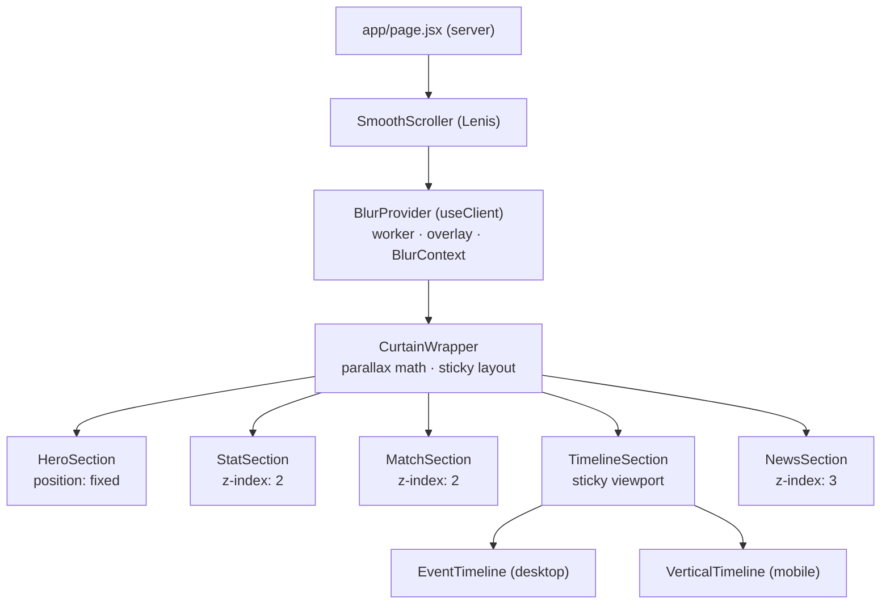
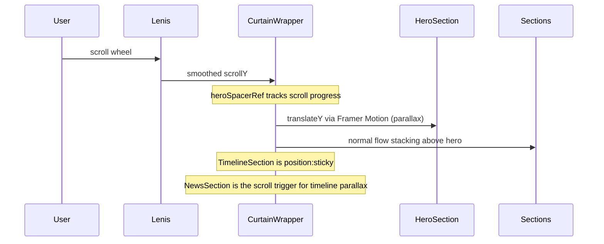
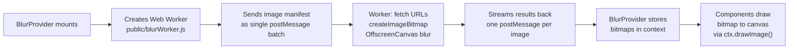
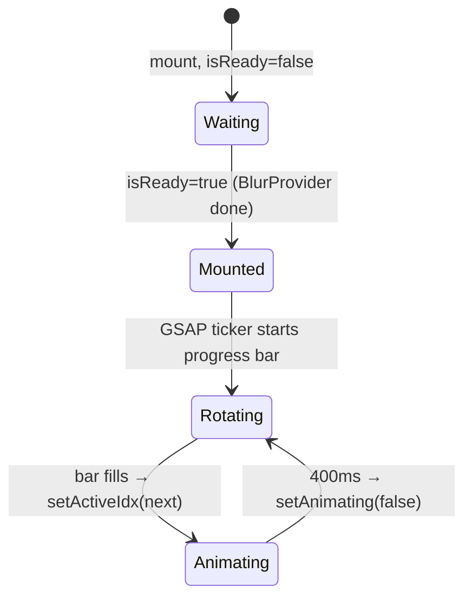
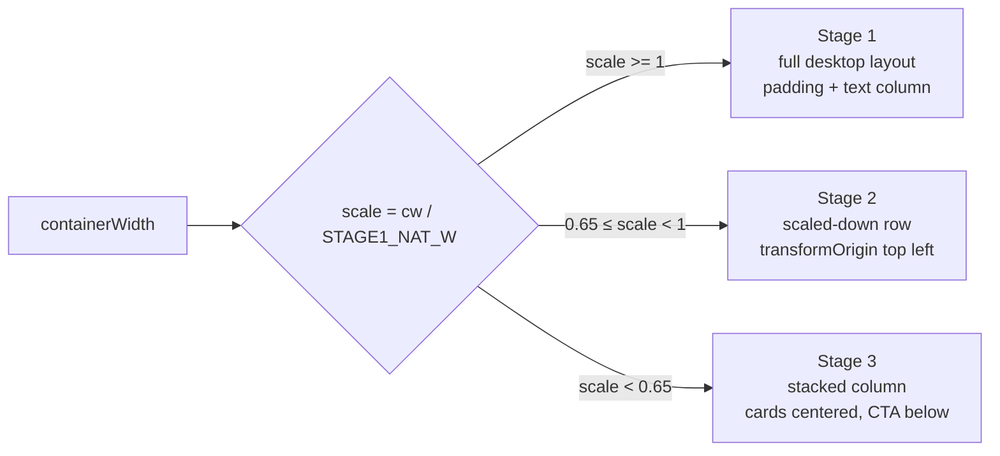
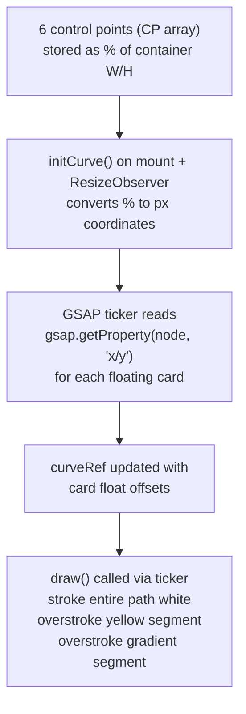

# Homepage System Documentation
**IPB University Sports Event Platform**

> For the `/` route — covers layout, scroll system, blur pipeline, image pipeline, every section component, and live data hooks.

---

## Table of Contents

1. [Tech Stack](#1-tech-stack)
2. [File Map](#2-file-map)
3. [Component Tree](#3-component-tree)
4. [Layout & Scroll System](#4-layout--scroll-system)
5. [Blur Pre-render Pipeline](#5-blur-pre-render-pipeline)
6. [Section Breakdown](#6-section-breakdown)
   - [HeroSection](#61-herosection)
   - [StatSection](#62-statsection)
   - [MatchSection](#63-matchsection)
   - [TimelineSection](#64-timelinesection)
   - [NewsSection](#65-newssection)
7. [Shared Card Components](#7-shared-card-components)
8. [Performance Rules](#8-performance-rules)
9. [Data & DB Schema](#9-data--db-schema)
10. [Known Constraints & Traps](#10-known-constraints--traps)
11. [Adding a New Section](#11-adding-a-new-section)

---

## 1. Tech Stack

| Layer | Tech |
|---|---|
| Framework | Next.js App Router |
| Rendering | All homepage sections are `"use client"`. No SSR concerns on this route. |
| Animation | GSAP (ticker, timeline, contextSafe via `useGSAP`) |
| Scroll | Framer Motion `useScroll` + `useTransform` for parallax. Lenis for smooth wheel. |
| Blur pipeline | Web Worker + OffscreenCanvas + ImageBitmap |
| Fonts | Bebas Neue (display), Plus Jakarta Sans (body) |
| Styling | Inline styles + Tailwind utility classes (mixed) |

---

## 2. File Map

```
app/
  page.jsx                      ← server component, entry point

components/
  BlurProvider.jsx              ← "use client", owns worker + page overlay
  CurtainWrapper.jsx            ← parallax/sticky scroll layout (NEVER TOUCH)
  SmoothScroller.jsx            ← Lenis wrapper
  EventCard.jsx                 ← event card, used in hero + both timelines
  Button.jsx
  UniversityMarquee.jsx

contexts/
  BlurContext.js                ← createContext + useBlur() hook

sections/
  HeroSection.jsx               ← fixed hero with rotating events + event cards
  StatSection.jsx               ← animated stat cards + CTA
  MatchSection.jsx              ← live match cards + upcoming table
  TimelineSection.jsx           ← desktop bezier timeline / mobile vertical

timeline-stuff/
  VerticalTimeline.jsx          ← mobile-only stacked card timeline

match-stuff/
  MatchCard.jsx                 ← match score card (6 score engine types)
  MatchTable.jsx                ← upcoming matches table
  FightBackground.jsx           ← video bg (mixBlendMode screen)

news-stuff/
  NewsCard.jsx                  ← news article card with animated arrow + blur
  
stats-stuff/
  StatCard.jsx                  ← individual stat card with image

public/
  blurWorker.js                 ← unified image processing worker
```

---

## 3. Component Tree



---

## 4. Layout & Scroll System

This is the trickiest part. Read carefully before touching anything in CurtainWrapper.

### How it works



### Layer z-index stack

| Layer | z-index | Position |
|---|---|---|
| HeroSection | 1 (inside motion.div) | `position: fixed` |
| heroSpacerRef div | — | Normal flow, reserves scroll height |
| StatSection + MatchSection | 2 | `position: relative` |
| TimelineSection | 2 | `position: sticky, top: 65px` |
| NewsSection | 3 | `position: relative` |
| BlurProvider overlay | 9999 | `position: fixed` |

### Parallax math

Two parallax transforms exist:

**Hero parallax** — tracks `heroSpacerRef` from `start start` to `end start`. Hero moves UP as you scroll past it at `PARALLAX_SPEED = 0.4`, creating depth.

**Timeline parallax** — tracks `newsSectionRef` from `start end` to `start start`. TimelineSection moves up as NewsSection enters, creating a curtain-pull effect.

Both use `useTransform(() => ...)` with live `viewportH.current` inside the callback. Never use a captured closure value for this — viewport height can change.

### heroPaused

CurtainWrapper puts an `IntersectionObserver` on `heroSpacerRef`. When the spacer leaves viewport (user has scrolled past the hero), `heroPaused = true` is passed to HeroSection. HeroSection uses this to pause its GSAP ticker and card rotation interval.

> **Why not IO on the hero itself?** HeroSection is `position: fixed` — it never leaves the viewport, so IO would always report it as intersecting. The spacer is the proxy.

---

## 5. Blur Pre-render Pipeline

### Why it exists

CSS `backdrop-filter: blur()` is re-computed every frame by the GPU from the live composited layer beneath it. For stacked blur layers (4 divs per card × 8+ cards), this is expensive especially on mobile. Pre-rendering the blur into a static bitmap means the GPU composites a flat image — essentially free.

### Architecture



### Overlay timing

```
MIN_MS = 1000ms   ← minimum spinner time regardless of image speed
MAX_MS = 6500ms   ← hard cap, lifts even if some images failed
FADE_MS = 600ms   ← opacity transition duration

Overlay lifts when: (all images done AND min time elapsed) OR hard cap hit
isReady = true: AFTER fade completes (FADE_MS after lift starts)
```

### BlurContext shape

```js
const { bitmaps, isReady } = useBlur();

// bitmaps keyed by URL:
bitmaps['https://...photo.jpg'] = {
  hero:      { sharp: ImageBitmap, blurred: ImageBitmap },
  eventcard: { bitmap: ImageBitmap },
  newscard:  { bitmap: ImageBitmap },
  matchcard: { bitmap: ImageBitmap },
}

// same URL can have multiple types if used in multiple components
// worker dedup key: `${url}_${type}`
```

### Blur types

| Type | Blur amount | Mask | Output size |
|---|---|---|---|
| `hero` | 24px | Applied via CSS in HeroSection | W × H |
| `eventcard` | 2/4/8/16px layered | 4 plateau masks, bottom-anchored | W × H |
| `newscard` | 1/3/6/10px layered | 4 plateau masks, bottom 55% crop | W × (H × 0.55) |
| `matchcard` | 6px flat | None | W × H |

### Canvas edge darkening fix

CSS `backdrop-filter` samples pixels beyond the element boundary (transparent → treated as source color). Canvas `ctx.filter = blur()` clips to canvas bounds → edge pixels get mixed with nothing → look dark.

**Fix:** `PAD_FACTOR = 3`. Before blurring, expand canvas by `blurPx × 3` on each side, draw image centered in expanded space, then crop back. Interior pixels after crop are pixel-identical to CSS backdrop-filter.

### DPR-aware canvas drawing

Every canvas that draws a bitmap uses this pattern:

```js
const ro = new ResizeObserver(([entry]) => {
  const { width, height } = entry.contentRect;
  const dpr = window.devicePixelRatio || 1;
  canvas.width  = Math.round(width  * dpr);   // physical pixels
  canvas.height = Math.round(height * dpr);
  canvas.style.width  = width  + 'px';         // CSS pixels
  canvas.style.height = height + 'px';
  const ctx = canvas.getContext('2d');
  ctx.scale(dpr, dpr);
  ctx.drawImage(bitmap, 0, 0, width, height);
});
ro.observe(canvas);
```

ResizeObserver fires on first `observe()` call (spec-defined), so no separate initial draw is needed.

### Fallback

All bitmap canvas paths are additive. If `bitmap === null` (worker not done yet, or image failed), every card falls back to its CSS `backdrop-filter` layers silently. No broken UI.

---

## 6. Section Breakdown

### 6.1 HeroSection

**What it does:** Rotating showcase of 8 featured events with animated background canvases, event card strip, progress bar, and University marquee.

**Key internals:**



| Ref | Purpose |
|---|---|
| `canvasRefs` | Map of `${id}_sharp` and `${id}_blur` canvas elements for each event |
| `barRef` | Progress bar element — written directly via style, no setState |
| `pausedRef` | Mirrors `paused` prop into a ref so ticker doesn't need it in dep array |
| `tabVisRef` | Mirrors `document.hidden` for tab-switch gating |

**Canvas draw pattern:** `bitmaps[ev.card_image_url]?.hero` gives `{ sharp, blurred }`. Both drawn via `ctx.drawImage()` — NOT `bitmaprenderer.transferFromImageBitmap()` because that closes the bitmap after one draw (Strict Mode would break).

**Blur mask (hero background):** Applied via CSS on the blur canvas, not in the worker. Three-directional gradient (bottom, left-right edges) creates the depth vignette.

**`mounted` state:** Used purely for CSS animation sequencing (`hero-bar-intro`, `hero-cards-intro`, `hero-marquee-intro`). Only flips true after `isReady` — so animations never play over the loading overlay.

**Scaling:** Uses a `scale` factor derived from container width vs natural 1440px design width. All pixel values (`margin`, `cardH`, etc.) multiply by `scale` at runtime.

**Mobile:** Shows 4 events instead of 8. Cards at fixed 160px height. activeIdx is clamped to mobile count on resize.

---

### 6.2 StatSection

**What it does:** Three stat cards (Participants, Universities, Events) + CTA, with responsive stage system and animated entrance.

**Stage system:**



- Stage 1: natural layout, everything fits, horizontal row
- Stage 2: entire row scaled down via `transform: scale()` inside a fixed-height wrapper — avoids reflow
- Stage 3: cards + CTA go vertical, CTA gets `centered` prop + smaller font

**Entrance animation:** `IntersectionObserver` at `threshold: 0.15`. Fires once, disconnects. Staggered `stat-intro` keyframe (defined in `globals.css`) on 6 slots.

`animStyles` is memoized on `visible` change — avoids creating new object literals per render that would break React's bailout.

**Images:** `universitiesImg`, `athletesImg`, `eventsImg` are Next.js static imports from `stats-stuff/`. Already optimized at build time. Do NOT include them in the blur worker.

**FightBackground:** Sits at z-0 inside StatSection. Plays a video with `mixBlendMode: screen` to knock out its black background. Only plays when `visible = true`.

---

### 6.3 MatchSection

**What it does:** Live match cards in a horizontal row + upcoming matches table.

**Match types (format.match_type):**

| Type | Score display | Example |
|---|---|---|
| `head_to_head` | Score vs score, or sets | Badminton, Karate kumite |
| `solo` | Single participant, judge scores or finish time | Vocal, Swimming |
| `open` | Multiple participants | Golf, Hackathon |

**Score engine modules (format.modules[0].type):**

| Engine | Component | Shows |
|---|---|---|
| `score_timed` | `ScoreTimed` | `homeScore - awayScore` |
| `score_sets` | `ScoreSets` | Set score + dots + set log |
| `judge_scores` | `JudgeScores` | Avg/sum/drop_extremes of judge array |
| `finish_time` | `FinishTime` | Ordered finish time log |
| `manual_pick` | `ManualPick` | Winner name or ranked list |

**Timer (format.modules.find type=timer):** DOM-ref pattern — `useMatchTimerDOM` writes directly to `ref.current.textContent` every second. Zero React re-renders for 5+ live timers simultaneously.

**Countdown vs stopwatch:** Timer config `mode: "countdown"` counts down from `timerSecs`. `mode: "stopwatch"` counts up from `timerSecs`. Both compute from `timerLastStarted` ISO string so they stay accurate if the component remounts.

**Layout:** Desktop: fixed-height horizontal row with scale-based margin. Mobile: horizontal scroll snap (`62vw` card width, `scroll-snap-type: x mandatory`). Scrollbar styles live in `globals.css` under `.match-scroll`.

**Data:** Currently hardcoded `LIVE_MATCHES` and `UPCOMING_MATCHES` arrays.
```
TODO: replace with Directus fetch
  GET /items/matches?filter[status][_eq]=live
  GET /items/matches?filter[status][_eq]=upcoming
```

---

### 6.4 TimelineSection

Switches between desktop and mobile at `window.innerWidth < 768`.

#### Desktop: EventTimeline

**What it does:** A bezier curve drawn on a Canvas element connects 4 floating EventCards. The curve animates drawing on scroll, cards float via GSAP, active event gets yellow path segment, upcoming gets gradient segment.

**Curve system:**



**Path segments:**
- `yPtsRef` = points from start to last active event → yellow
- `gPtsRef` = points from last active to first upcoming → gradient (yellow→white)
- Full path → white

**Intro animation:** `gsap.to(proxy, { drawn: wLen })` drives `introProg.current` 0→1. The ticker reads this to set dash offsets, revealing the path progressively. Cards pop in when the path reaches each control point (`subLengths` array).

**Arc LUT:** A float32 lookup table (400 steps) built from the bezier curve. Used to position the traveling dot at arc-length coordinates rather than parametric-t coordinates (prevents uneven speed along curve).

**Performance gates:**
- `visibleRef` — IO on container, gates the ticker
- `tabVisRef` — `document.hidden`, also gates the ticker
- `postCapMs` — after intro finishes, ticker throttles to 30fps unless float position changed

**Float animations:** One shared `gsap.timeline()` (`floatTlRef`) handles all 4 cards. Stored in ref so IO + visibility callbacks can `pause()`/`resume()` it.

#### Mobile: VerticalTimeline

**What it does:** Vertical stacked layout. Cards alternate left/right of a center line. Line fill animates on scroll via `ScrollTrigger`. Cards entrance + float via GSAP.

**Float tweens:** Stored in `floatTweensRef` (array of tween refs). IO + visibilitychange pause/resume them. Array is reset on each effect run to avoid Strict Mode accumulation.

**Scroll trigger:** `fillRef` (the yellow line segment) animates `scaleY` from 0→1 triggered by the wrapper entering `top 85%`.

---

### 6.5 NewsSection

**What it does:** 1 large card + 4 small cards. Desktop: CSS grid (2fr 1fr 1fr, 2 rows). Mobile: stacked column with 2×2 small grid.

**Data:** `DUMMY_NEWS` array. Replace with:
```
GET /items/news
  ?filter[is_published][_eq]=true
  &fields[]=id,title,slug,excerpt,thumbnail_url,category,published_at
  &fields[]=event_id.name
  &sort[]=-published_at
  &limit=5
```

**Bitmap pass-through:** `useBlur()` → `bitmaps[url]?.newscard?.bitmap ?? null` passed to each NewsCard. NewsCard handles null by falling back to CSS BLUR_LAYERS.

---

## 7. Shared Card Components

### EventCard

Used in: HeroSection strip, EventTimeline (desktop), VerticalTimeline (mobile).

Props:
| Prop | Type | Default | Notes |
|---|---|---|---|
| `event` | object | required | `{ slug, name, card_image_url, user_created }` |
| `className` | string | `""` | Tailwind classes added to Link |
| `size` | `"sm" \| "md" \| "lg"` | `"md"` | Controls text sizes |
| `bitmap` | ImageBitmap | `null` | From BlurProvider; falls back to CSS if null |

Canvas path sits behind the gradient overlay div. CSS fallback: 4 `backdrop-filter` divs with plateau masks.

### NewsCard

Props:
| Prop | Type | Default | Notes |
|---|---|---|---|
| `thumbnail_url` | string | required | CSS background + blur source |
| `tag` | string | `null` | Event name from join |
| `title` | string | required | |
| `isMain` | bool | `false` | Large vs small layout |
| `compact` | bool | `false` | Mobile size reduction |
| `bitmap` | ImageBitmap | `null` | Bottom 55% crop from worker |

Canvas sits inside `blurContainer` (bottom 0, height 55%). `colorOverlay` (bottom gradient) always renders in both paths.

Arrow icon animates stroke-dashoffset on hover via GSAP. Box shadow animates on hover (yellow glow). Both cleaned up with `gsap.killTweensOf()` on opposite event.

### MatchCard

Props:
| Prop | Type | Default | Notes |
|---|---|---|---|
| `match` | object | required | Full match object from API |
| `bitmap` | ImageBitmap | `null` | Flat 6px blur, full card |

Two background layers: `cardBg` (sharp, no filter) + `cardBgBlur` (bitmap canvas OR CSS blur div). This split lets the GPU cache the base image independently from the blur layer.

`contain: "layout paint"` on the card prevents style recalc from propagating outside the card boundary.

### StatCard

No blur. Takes `image_url` (accepts Next.js static import object or plain string), `main_stat`, `label_stat`, `width`, `height`. Simple image + bottom gradient panel.

---

## 8. Performance Rules

These are non-negotiable patterns established during development. Breaking them causes jank.

**1. Tickers write to refs, not state.**
Any value updated every frame (timer text, progress bar position, canvas draw) must write to a DOM ref directly. `setState` in a ticker = React re-render every frame = layout thrash.

**2. Dep arrays on ticker effects must be minimal.**
If `paused` (or any frequently-changed value) is in a ticker's dep array, the effect tears down and re-registers the ticker on every change. The bar resets, the animation stutters. Use `pausedRef.current` inside the ticker instead.

**3. No IO on `position: fixed` elements.**
They never leave the viewport. IO will always report them as intersecting. Use a proxy element (heroSpacerRef) in the normal flow.

**4. No two IOs on the same element.**
Use a `threshold` array (e.g. `[0, 0.15]`) to handle both the visibility gate and the intro trigger in one observer.

**5. GSAP `repeat: -1` tweens must be stored in refs.**
Orphaned local variables can't be paused, resumed, or killed. Store them in a ref (or `floatTlRef`, or `floatTweensRef` array) so IO + visibilitychange callbacks can control them.

**6. `buildEvents()` / static data at module level.**
Functions that produce derived data from constants must run once at module load, not inside the component body. Every state update would trigger a re-run otherwise.

**7. `useGSAP` + `contextSafe` for all delayed/async GSAP calls.**
`contextSafe()` registers tweens with GSAP's internal context. On unmount, `context.revert()` kills everything automatically. Plain functions called from IO callbacks or `setTimeout` bypass this — wrap them.

**8. `floatTweensRef` array reset on each effect.**
`floatTweensRef.current = []` at the top of the useEffect body. React Strict Mode double-invokes effects in dev — without the reset, the second run appends to stale tween refs from the first.

**9. `drawImage` not `transferFromImageBitmap`.**
`bitmaprenderer.transferFromImageBitmap()` closes/consumes the bitmap — can only draw once. Bitmaps stored in BlurContext are shared across multiple canvases (EventCard appears in hero strip AND both timelines). Always use `ctx.drawImage(bitmap, ...)`.

---

## 9. Data & DB Schema

All data currently uses hardcoded mock objects. When connecting to Directus:

### Events (for HeroSection + Timeline)
```
GET /items/events
  ?filter[status][_in]=active,upcoming
  &fields[]=id,slug,name,description,status,start_date,card_image_url
  &fields[]=user_created.organisation_name
  &fields[]=registration_closes
  &sort[]=start_date
  &limit=8
```

### News
```
GET /items/news
  ?filter[is_published][_eq]=true
  &fields[]=id,title,slug,thumbnail_url,category,published_at
  &fields[]=event_id.name
  &sort[]=-published_at
  &limit=5
```

### Live Matches
```
GET /items/matches
  ?filter[status][_eq]=live
  &fields[]=id,status,round,venue,match_name,scheduled_at
  &fields[]=competition_category.name
  &fields[]=event.name,event.card_image_url
  &fields[]=format,live_state
  &fields[]=home_participant.name,home_participant.institution.*
  &fields[]=away_participant.name,away_participant.institution.*
  &fields[]=participants.*
```

### Match format schema

```js
format: {
  match_type: "head_to_head" | "solo" | "open",
  modules: [
    // score engine (required)
    {
      type: "score_timed" | "score_sets" | "judge_scores" | "finish_time" | "manual_pick",
      config: { /* engine-specific */ }
    },
    // timer (optional)
    {
      type: "timer",
      config: { mode: "countdown" | "stopwatch", duration: number }
    }
  ]
}
```

---

## 10. Known Constraints & Traps

**CurtainWrapper is sacred.** Do not modify it. Not even comments. The parallax math is fragile — one extra wrapper div or a changed ref breaks the scroll effect. Verify by scrolling after any nearby change.

**EventCard is used in 3 places with different sizes.** Any visual change must be checked at `size="sm"` (hero strip), `size="md"` (default), and `size="lg"` (timeline cards).

**The timeline canvas uses `desynchronized: true` context.** This allows the canvas to render off the main thread cadence in some browsers. Don't switch to a 2D context without this flag on the timeline canvas — it's there for a reason.

**Timeline CP array is in percentage coordinates.** `CP[i].pctX` is a fraction of container width. The actual conversion to pixels happens in `initCurve()` on every resize. Never hardcode pixel positions for the curve.

**BlurProvider DEFAULT_MANIFEST is hardcoded.** It lists specific Unsplash + picsum URLs. When switching to real DB data, the manifest must be built dynamically from fetched event/news URLs and passed as a prop to `<BlurProvider imageManifest={...}>`. The prop is already supported.

**`scale(1.1)` on the old CSS blur layer.** The old MatchCard CSS blur div used `transform: scale(1.1)` to hide edge bleed. The bitmap canvas path doesn't need this — PAD_FACTOR in the worker handles it. Don't add scale to the canvas.

**Safari backdrop-filter stacking.** The CSS fallback path stacks 4 `backdrop-filter` divs. Safari can struggle with more than 2-3 stacked `backdrop-filter` elements on the same source. This is exactly why the bitmap path exists — bitmap path renders perfectly on Safari with zero GPU blur cost.

---

## 11. Adding a New Section

1. **Create the section component** in `sections/`. Mark `"use client"`. Follow the `useContainerWidth` + `isMobile` pattern from StatSection/NewsSection.

2. **Add to CurtainWrapper.** It currently has a fixed sequence. Decide where in the z-stack the new section lives and add it to the appropriate `<div>` group (z-index 2 with Stat+Match, or after Timeline, etc.).

3. **If the section has heavy images that need blur:**
   - Add the image URLs to the manifest in `BlurProvider.jsx` (DEFAULT_MANIFEST array) with the correct type and dimensions.
   - In your component: `const { bitmaps } = useBlur()` and pass `bitmap={bitmaps[url]?.yourtype?.bitmap ?? null}` to the card component.
   - Add a canvas draw path in the card component using the DPR-aware ResizeObserver pattern.
   - Add the blur type processor in `blurWorker.js`.

4. **If the section has entrance animations:**
   - Use `IntersectionObserver` at `threshold: [0, 0.15]` — one IO for visibility gate + intro trigger.
   - Use `useGSAP` + `contextSafe` for any GSAP calls inside IO callbacks.
   - Store `repeat: -1` tweens in refs.

5. **If the section has a live ticker:**
   - Write to DOM refs, not state.
   - Gate on both `visibleRef.current` and `tabVisRef.current`.
   - Keep dep array minimal — use refs for anything that changes frequently.