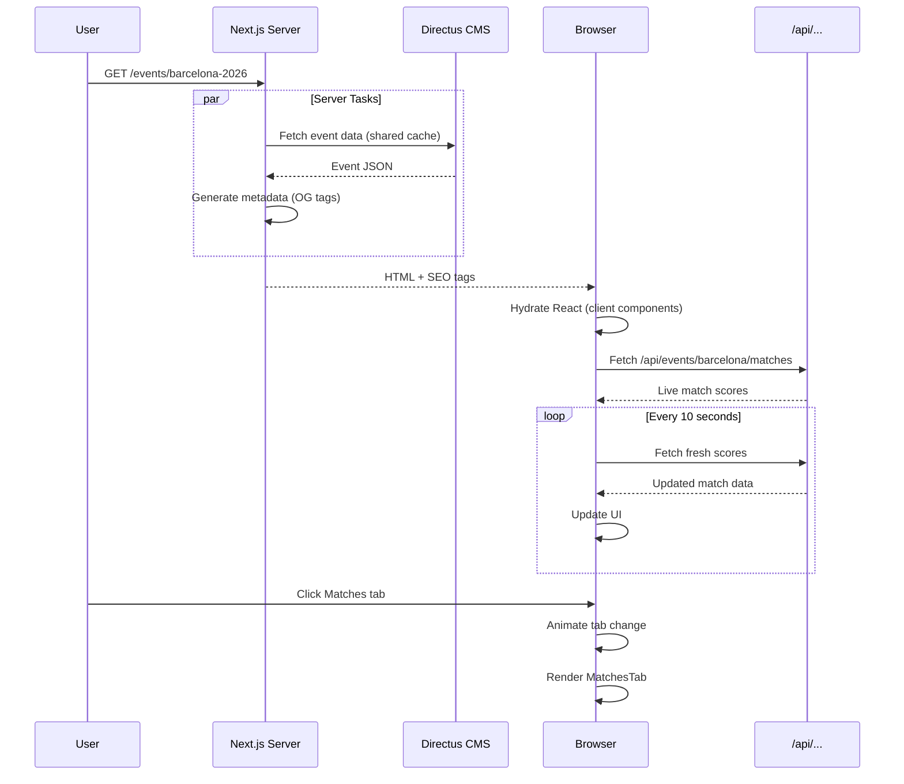
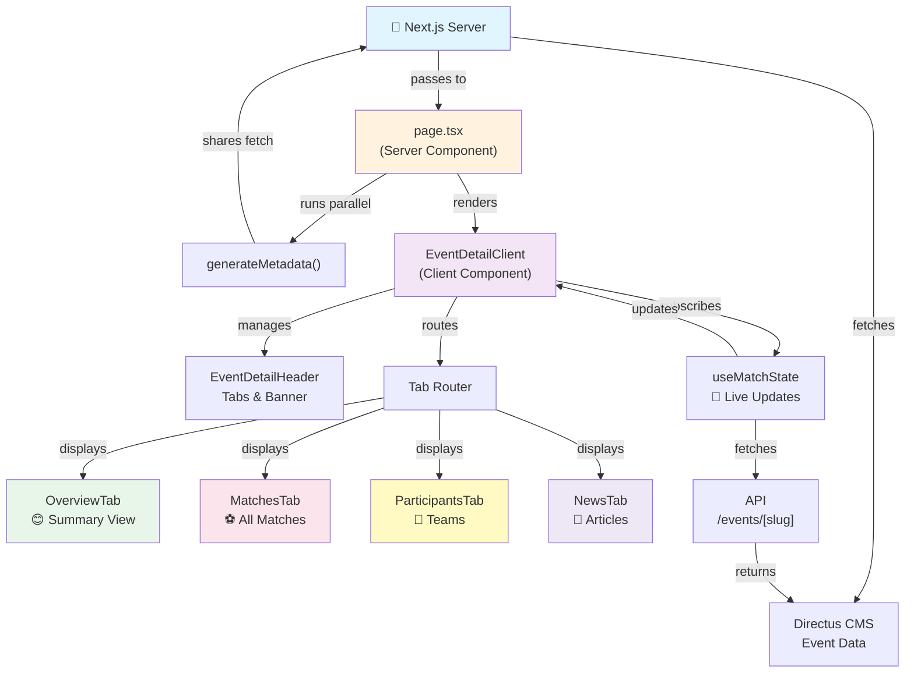
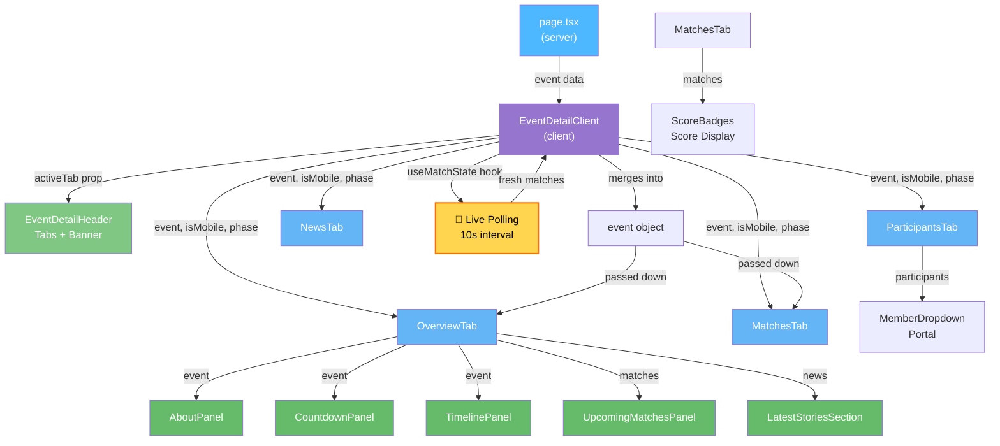
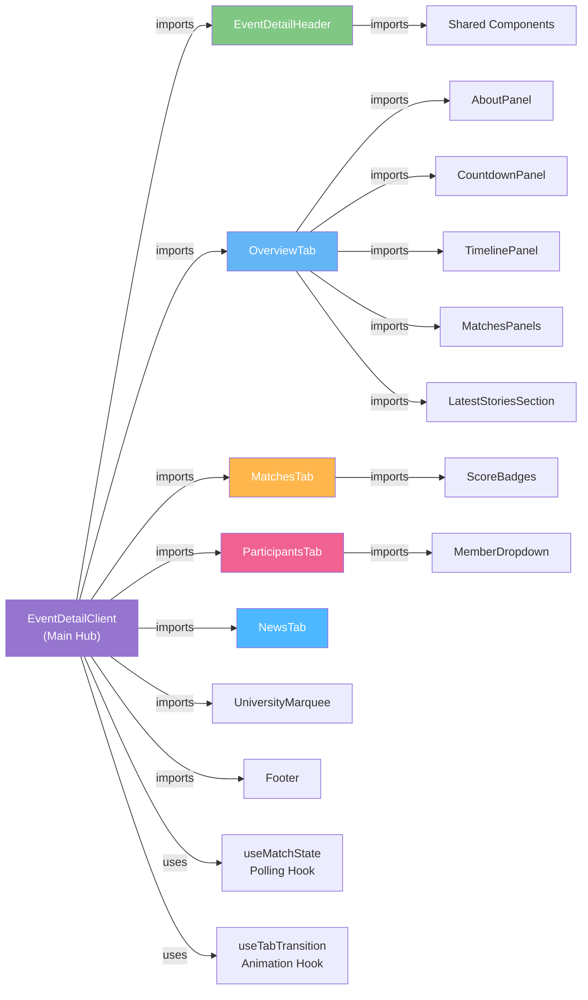
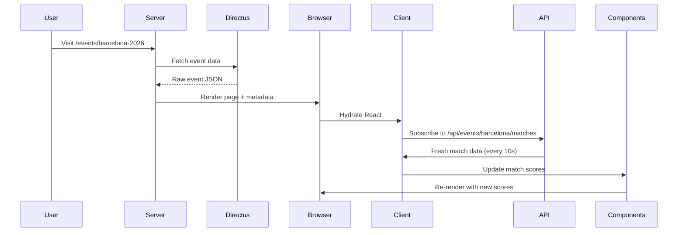
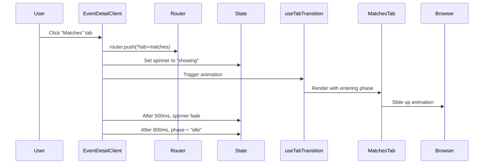
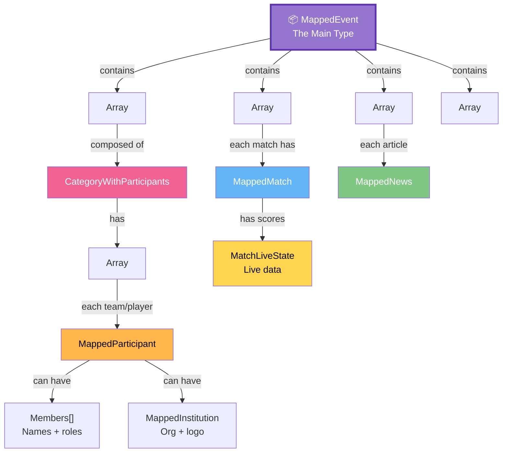

# Event Details Page 📅 Developer Guide

> **A comprehensive guide for understanding, maintaining, and extending the Event Details Page**

⏱️ **Reading Time:** 15 min for overview, 45 min for deep dive

---

## 🎯 One Minute Pitch

This page shows a single event with live updates. Users can switch between 4 tabs (Overview, Matches, Participants, News). Match scores update automatically every 10 seconds. Built with Next.js, React, TypeScript. The page is animated, mobile-responsive, and type-safe.

**The architecture:** Server renders initial state → Client manages tabs & animations → Polling hook keeps match scores fresh.

---

## 📊 Visual Map: How Request Flows



## 🚀 Quick Summary

The Event Details Page displays detailed information about IPB-LSA events with live match updates, participant lists, and news feed. Think of it as a **single event hub** where users can:

- 👀 See event overview with timeline
- ⚽ Watch live and past match results  
- 👥 Browse participating teams/individuals
- 📰 Read latest news about the event
- 🔄 Get live score updates automatically (10-second polling)

Built with **Next.js**, **React 18**, **TypeScript**, and features smooth animations plus responsive mobile design.

## ✨ Key Features at a Glance

| Feature | What It Does |
|---------|-------------|
| **Tab Navigation** | Switch between Overview, Matches, Participants, News |
| **Live Polling** | Match scores refresh every 10 seconds automatically |
| **Smart Layouts** | Desktop shows 2-column view; mobile adapts gracefully |
| **Member Dropdowns** | Hover over participants to see team member details |
| **Animations** | Smooth page enter + tab transitions with staggered timing |
| **SEO Ready** | Auto-generates Open Graph tags for social sharing |
| **Error Boundaries** | One tab crashes? Others keep working |
| **Type-Safe** | Full TypeScript prevents runtime errors |


---

## 🗺️ Architecture Overview

Here's how data flows through the page:



---

## 🏗️ Component Hierarchy (Props Flow Down)



---

## 🧬 Component Dependency Map



---

## 📁 Project File Structure

```
events/[slug]/
├── page.tsx                           # 🔧 Server component - data fetching + metadata
├── EventDetailClient.tsx              # 💫 Client orchestrator - tabs + animations
├── _types.ts                          # 📦 All TypeScript interfaces & types
│
├── _components/
│   ├── EventDetailHeader.tsx          # 🎨 Header, banner, tab buttons, status badge
│   │
│   ├── tabs/                          # 📑 Main content sections (user selectable)
│   │   ├── OverviewTab.tsx            # Home - panels layout with smart sizing
│   │   ├── MatchesTab.tsx             # All matches with filtering & sorting
│   │   ├── ParticipantsTab.tsx        # Teams/players with member popups
│   │   └── NewsTab.tsx                # Articles feed view
│   │
│   ├── panels/                        # 🧩 Reusable container components
│   │   ├── Panel.tsx                  # Base: PanelCard, PanelTitle, EmptyState
│   │   ├── AboutPanel.tsx             # Event description & contacts
│   │   ├── CountdownPanel.tsx         # Phase countdown timer
│   │   ├── TimelinePanel.tsx          # Event phases timeline
│   │   ├── MatchesPanels.tsx          # Upcoming & results snippets
│   │   └── LatestStoriesSection.tsx   # News preview cards
│   │
│   ├── match/                         # ⚽ Score display utilities
│   │   ├── ScoreBadges.tsx            # Score components (badges, cells)
│   │   └── scoreUtils.ts              # Score formatting & helpers
│   │
│   └── shared/                        # 🎯 Shared utilities & styles
│       ├── Animations.ts              # Keyframe definitions & timing
│       ├── UseTabTransition.ts        # Tab animation state hook
│       ├── ErrorBoundary.tsx          # Error catching wrapper
│       ├── tokens.ts                  # Design tokens (colors, fonts)
│       ├── NewsCardSkeleton.tsx       # Loading placeholder
│       └── NewsPlaceholder.tsx        # Empty state UI
│
└── hooks/
    └── useMatchState.ts               # 🔄 Live match polling hook

```

---

## 🎯 Getting Started (For New Maintainers)

### What to read first?

**If you have 5 minutes:** Read the "Quick Summary" above and look at the diagrams.

**If you have 15 minutes:** 
1. Understand the diagram flow
2. Read "Where Things Live (File Overview)"
3. Skim the "Component Tour" section below

**If you have 1 hour:**
1. Read entire "Component Tour"
2. Open `EventDetailClient.tsx` and trace the imports
3. Look at one tab component (e.g., `OverviewTab.tsx`) to see pattern

### The two most important files

```
📍 page.tsx
   ↳ Server: fetches event data, renders metadata
   
📍 EventDetailClient.tsx  
   ↳ Client: manages tabs, animations, live polling
```

If you need to understand how data flows, start here. Everything else builds on these two.

### Where Things Live (Quick Reference)

| I need to... | File | Pattern |
|--|--|--|
| Add a new tab | `_components/tabs/NewTab.tsx` | Copy from `OverviewTab` |
| Change colors/fonts | `_components/shared/tokens.ts` | Edit constants |
| Fix animations | `_components/shared/Animations.ts` | Update keyframes |
| Change how matches display | `_components/match/ScoreBadges.tsx` | Modify component |
| Add a panel to Overview | `_components/panels/*.tsx` | Create + import in OverviewTab |
| Handle page errors | `_components/shared/ErrorBoundary.tsx` | Wrap components |

---

## 🏗️ Component Tour

### Page Rendering Layer

#### `page.tsx` (Server Component)
**What it does:** Fetches event, builds SEO tags, returns Suspense boundary

```tsx
// 1. Fetch event data server-side
const event = await getEventDetail(params.slug);

// 2. Generate metadata for social sharing
export async function generateMetadata() { ... }

// 3. Wrap client component in Suspense
<Suspense><EventDetailClient event={event} /></Suspense>
```

**Key points:**
- ✅ Uses Next.js request memoization (same fetch called by metadata + page)
- ✅ Returns 404 if event doesn't exist (`notFound()`)
- ⚠️ Don't add `"use client"` to this file

---

#### `EventDetailClient.tsx` (Client Component)
**What it does:** Main orchestrator - manages tabs, animations, live polling

**State it manages:**
- Active tab (from URL query `?tab=matches`)
- Animation phase (entering/idle)
- Spinner visibility during tab loads
- Mobile/desktop detection
- Live match data (via hook)

**The key pattern:**
```tsx
// 1. Get active tab from URL
const activeTab = searchParams.get("tab") ?? "overview";

// 2. Subscribe to live matches
const { matches } = useMatchState(event.slug, event.matches);

// 3. Merge live data into event object
const liveEvent = { ...event, matches };

// 4. Route to correct tab component
if (displayedTab === "overview") return <OverviewTab event={liveEvent} />;
```

**Gotchas:**
- Router.push() with `{ scroll: false }` prevents auto-scroll on tab change
- Spinner state machine ensures spinners aren't too fast/jarring
- Reconcile live matches before passing to tabs

---

### Tab Components

#### `OverviewTab.tsx` 
**What it does:** Homepage layout - shows event summary, upcoming matches, latest news

**Left column (always visible):**
- About panel (description + contacts)
- Timeline panel (event phases)
- Countdown panel (next phase timer)

**Right column (smart-sized):**
- Upcoming matches panel
- Latest results panel
- Height adapts to fit as many matches as viewport allows

**The magic:** Smart height calculation using `useMemo`
- Measures viewport space
- Fits maximum match rows without overflow
- Falls back gracefully if no matches exist

**Gotchas:**
- Column layout constants (DATE_H, ROW_H_DEFAULT) must match MatchesPanels height
- If you change MatchesPanels styling, update these constants!

---

#### `MatchesTab.tsx`
**What it does:** Full match list - all matches grouped by date, live scores

**Features:**
- Sorted newest-first (future dates first)
- Date headers with grouping
- Score display varies by sport type (sets vs. points)
- Live score animations

**Score display logic:**
```
if engine.type === "score_sets":
  Show: [Set count] vs [Set count] + detail line
else:
  Show: Home score vs Away score
```

---

#### `ParticipantsTab.tsx` ⭐ (Most Complex)
**What it does:** Browse teams/players grouped by competition category

**Interactive features:**
- Grid layout (responsive columns)
- Category headers with collapsible animation
- **Member dropdown:** Hover on card → shows team members

**Dropdown specifics:**
- Portal-based (renders at document root, not in card)
- Smart positioning (adjusts if near viewport edges)
- Close delay on hover-away (120ms gap tolerance)
- Smooth clip-path animations for reveal/hide

**Animation sequence on load:**
```
Group 1 enters → wait 80ms
Group 2 enters → wait 80ms
Within group: card1 → wait 40ms → card2 → wait 40ms
```

**Testing dropdown:** Hover on any participant card, then slowly move mouse to dropdown and back

---

#### `NewsTab.tsx`
**What it does:** Articles feed - article cards with thumbnails, categories

**Layout:** Responsive grid that reflows on mobile

---

### Panel Components (Building Blocks)

#### `Panel.tsx` (Base)
Three simple reusable components:
```tsx
<PanelCard>        {/* white box with padding */}
  <PanelTitle>     {/* section heading */}
  <EmptyState>     {/* placeholder when no data */}
</PanelCard>
```

---

#### `AboutPanel.tsx`
Shows event description + contact persons list

**Data source:** `event.description` and `event.contact_person[]`

---

#### `CountdownPanel.tsx` & `TimelinePanel.tsx`
**Countdown:** Displays next phase + timer until it starts

**Timeline:** Shows all phases chronologically, highlights current phase

---

#### `MatchesPanels.tsx`
Two side-by-side panels:
- `UpcomingMatchesPanel` - future matches (limited rows)
- `LatestResultsPanel` - completed matches (newest first)

**Used in:** OverviewTab right column + MatchesTab

---

#### `LatestStoriesSection.tsx`
News preview section - shows 3-4 latest articles, links to NewsTab

---

### Shared Utilities

#### `Animations.ts` - The Animation System
Defines all keyframes + timing constants used across page

**Global keyframes:**
```typescript
@keyframes slide-up     // Slide in from bottom with fade
@keyframes fade-in      // Just opacity change

PAGE_ENTER = 900ms      // Initial page load animation duration
TAB_ENTER = 800ms       // Tab change animation duration
STAGGER = 30ms          // Default delay between items
```

**How to use:**
```tsx
style={{
  animation: `slide-up 0.6s ease-out ${index * STAGGER}ms`,
  animationFillMode: "both"
}}
```

**Remember:** When you change animation durations, update hook timing too!

---

#### `UseTabTransition.ts` - Tab Animation Hook
Manages animation phases when switching tabs

**Returns:** `{ displayedTab, phase }`

**Phases:**
- `"entering"` - Tab just switched, play enter animation
- `"idle"` - Tab animations finished, hold steady

**Timing:**
- Initial render: 900ms entering → idle
- Tab switch: 800ms entering → idle

---

#### `tokens.ts` - Design System
All colors and fonts defined here

```typescript
// Fonts
JK = 'Plus Jakarta Sans'  // Body text
BB = 'Bebas Neue'         // Headings

// Colors
NAVY = "#06125C"          // Dark navy
ACCENT_BLUE = "#0D26C2"   // Bright blue
YELLOW = "#FFC936"        // Accent yellow
```

**Adding a new color:** Add constant here, never hardcode colors in components

---

#### `ErrorBoundary.tsx`
Catches render errors in child components

**How:** Tab crashes → boundary catches it →show fallback UI → other tabs fine

---

### Match Display System

#### `ScoreBadges.tsx`
Score display components for different sport types:
- `ScoreCell` - Main score display
- `MiddleBadge` - "Upcoming" or "vs" badge

**Engine-aware rendering:**
Different sports show different score formats (this is automatic)

#### `scoreUtils.ts`
Helper functions:
- `getEngine()` - Get sport type from format
- `fmtTime()` - Format time for display
- `fmtDate()` - Format dates
- `groupByDate()` - Group matches by date
- `resolveWinnerName()` - Get winner name from score

---

### Data Hooks

#### `useMatchState.ts` - Live Polling
Keeps match data fresh every 10 seconds

```typescript
const { matches, lastUpdated, isPolling } = useMatchState(
  event.slug,
  event.matches  // initial data
);
```

**How it works:**
1. Fetch `/api/events/[slug]/matches` every 10 seconds
2. Pause when tab hidden (saves bandwidth)
3. Cancel in-flight requests on cleanup
4. Return fresh matches array

**Swap to WebSocket later:** Just replace the `setInterval` with socket listener, shape never changes!

---

## 📊 Data Types (The Contract)

### Tab Navigation Types

```typescript
type TabKey = "overview" | "matches" | "participants" | "news";
type AnimPhase = "entering" | "idle";
type EventStatus = "upcoming" | "ongoing" | "concluded";
```

### Tab Navigation Types

```typescript
type TabKey = "overview" | "matches" | "participants" | "news";
type AnimPhase = "entering" | "idle";
type EventStatus = "upcoming" | "ongoing" | "concluded";
```

### The Main Event Type (What You'll Use)

```typescript
interface MappedEvent {
  // Identifiers
  id: string;
  name: string;
  slug: string;
  status: "upcoming" | "ongoing" | "concluded";
  
  // Dates
  start_date: string | null;
  end_date: string | null;
  registration_end_date: string | null;
  
  // Content
  description: string | null;
  location: string | null;
  organiser: string;
  
  // Media
  banner_image: { id: string };
  card_image: { id: string };
  url_youtube: string | null;
  
  // Events
  phases: DirectusPhase[];       // Timeline phases
  matches: MappedMatch[];        // Matches (LIVE UPDATED)
  news: MappedNews[];            // News articles
  participants: CategoryWithParticipants[]; // Teams grouped by category
  
  // Engagement
  registration_url: string | null;
  is_registration_open: boolean;
  guidebook_url: string | null;
  instagram_url: string | null;
  contact_person: { name: string; contact: string }[];
}
```

### Event Subcomponents

**MappedMatch** - One match/game
```typescript
{
  id: string;
  status: "upcoming" | "live" | "concluded";
  scheduled_at: string | null;
  round: string | null;           // "Quarterfinal", "Pool A"
  venue: string | null;           // Location
  winner: string | null;
  live_state: {
    homeScore?: number;
    awayScore?: number;
    setScore?: [number, number];  // For set-based sports
    setLog?: Array<{ home: number; away: number }>;
  };
  competition_category: { id: string; name: string; format_id: { ... } };
  home_participant: MappedParticipant | null;
  away_participant: MappedParticipant | null;
}
```

**MappedParticipant** - One team/player
```typescript
{
  id: string;
  name: string;
  members: Array<{ name: string; role?: string; email?: string }> | null;
  institution: {
    id: string;
    name: string;
    logo_url: string | null;
  } | null;
  competition_category_id: { id: string; name: string };
}
```

**MappedNews** - One article
```typescript
{
  id: string;
  title: string;
  slug: string;
  excerpt: string | null;
  content: string | null;
  is_published: boolean;
  published_at: string | null;
  thumbnail_url: string | null;
  category: string | null;
  event_id: { name: string; slug?: string } | null;
}
```

**CategoryWithParticipants** - Grouped participants
```typescript
{
  category: { id: string; name: string; display_order: number };
  participants: MappedParticipant[];  // All teams in this category
}
```

---

## 🛠️ Common Development Tasks

### Add a New Tab

Want to add a 5th tab? Here's the checklist:

**Step 1:** Create the component
```tsx
// _components/tabs/MyNewTab.tsx
"use client";

import { staggerSlideUp, TAB_ENTER } from "../shared/Animations";
import type { AnimPhase } from "../shared/UseTabTransition";
import type { MappedEvent } from "../../_types";

export default function MyNewTab({
  event,
  isMobile,
  phase,
}: {
  event: MappedEvent;
  isMobile: boolean;
  phase: AnimPhase;
}) {
  return (
    <div style={{ animation: phase === "entering" ? `${TAB_ENTER} ...` : "none" }}>
      {/* Your content here */}
    </div>
  );
}
```

**Step 2:** Add to tab router
```tsx
// EventDetailClient.tsx
import MyNewTab from "./tabs/MyNewTab";

// In the return JSX:
if (displayedTab === "mynew") return <MyNewTab {...props} />;
```

**Step 3:** Add to header tabs list
```tsx
// EventDetailHeader.tsx → TABS array
{ key: "mynew", label: "My New Tab" }
```

**Step 4:** Update types
```tsx
// _types.ts
export type TabKey = "overview" | "matches" | "participants" | "news" | "mynew";
```

✅ Done! The tab is now navigable via `?tab=mynew`

---

### Change Colors or Fonts

All design tokens in one place:

```tsx
// _components/shared/tokens.ts

// Change the accent color?
export const ACCENT = "#FF6B35";  // Change from #FFC936

// Add a new color?
export const SUCCESS_GREEN = "#10B981";

// Use in components:
import { ACCENT, SUCCESS_GREEN } from "../shared/tokens";

// Then:
<div style={{ color: ACCENT }}>Text</div>
```

---

### Fix or Add Animations

All animations defined in one file:

```tsx
// _components/shared/Animations.ts

export const KEYFRAMES = `
  @keyframes my-custom {
    from { opacity: 0; scale: 0.95; }
    to   { opacity: 1; scale: 1; }
  }
`;

export const MY_DURATION = 600; // ms
```

Then use in component:
```tsx
<div style={{ 
  animation: `my-custom ${MY_DURATION}ms ease-out` 
}}>
```

**Timing reference:**
- PAGE_ENTER: 900ms (initial load)
- TAB_ENTER: 800ms (tab switch)
- Group stagger: 80ms
- Card stagger: 40ms

---

### Update Match Display Format

Match scores are rendered in `ScoreBadges.tsx` with engine-aware logic.

**Add new score type:**

1. Get the format engine:
```tsx
const engine = getEngine(match.competition_category?.format_id);
```

2. Add conditional in `ScoreCell`:
```tsx
if (engine?.type === "my-new-type") {
  return <MyScoreDisplay match={match} />;
}
```

3. Utility functions in `scoreUtils.ts` for formatting

---

### Add a New Panel to Overview

1. Create panel component in `_components/panels/`
2. Import in `OverviewTab.tsx`
3. Add to left or right column JSX
4. Done! (It'll auto-animate with stagger)

```tsx
// OverviewTab.tsx
import MyNewPanel from "../panels/MyNewPanel";

return (
  <div style={{ display: "flex", gap: 24 }}>
    <div>
      {/* Left column */}
      <AboutPanel event={event} isMobile={isMobile} />
      <CountdownPanel event={event} />
      <MyNewPanel event={event} />  {/* ← Add here */}
    </div>
    <div>{/* Right column */}</div>
  </div>
);
```

---

### Handle or Prevent Errors

Wrap error-prone components:

```tsx
import { ErrorBoundary } from "../shared/ErrorBoundary";

return (
  <ErrorBoundary>
    <SlightlyBuggyComponent />
  </ErrorBoundary>
);
```

If that component crashes, the error boundary catches it and other tabs still work.

---

### Make the Page Faster

**Current optimizations:**
- ✅ Server-renders initial state (no blank page)
- ✅ Request memoization (metadata + page share fetch)
- ✅ Images lazy-load
- ✅ Tab content doesn't render until active
- ✅ Match polling cancels older requests

**If still slow:**
1. Check OverviewTab layout calculations (can be expensive on many matches)
2. Use Chrome DevTools → Performance tab
3. Look for long JavaScript execution

---

## 📡 Data Flow

### How data gets from Directus to screen



### Round trip for tab change


   - Other tabs use server-rendered data passthrough

---

## 🎬 Animation System Explained

### How Animations Work

1. **First page load (900ms)**
   - Elements slide up from bottom with staggered delays
   - Each element waits: index × 30ms before starting

2. **Tab switch (800ms)**
   - New tab content slides in
   - Old tab immediately swapped (no fade-out)
   - Spinner plays minimum 500ms to avoid flash

3. **Component details**
   - Participants: groups stagger 80ms, cards stagger 40ms
   - Member dropdown: clip-path reveal + slight scale-up

### Animation Constants (Edit Here)

```tsx
// _components/shared/Animations.ts
export const PAGE_ENTER  = 900;  // Initial load animation
export const TAB_ENTER   = 800;  // Tab switch animation  
export const STAGGER     = 30;   // Default item delay
```

### Using Animations in Components

```tsx
// Simple: staggered slide-up
<div style={{
  animation: `slide-up 0.6s ease-out ${index * STAGGER}ms`,
  animationFillMode: "both"  // Start invisible until animation plays
}}>

// Tab-aware: different animation per phase
<div style={{
  animation: phase === "entering" ? `slide-up ${TAB_ENTER}ms ...` : "none"
}}>
```

---

## 📱 Responsive Design

### How It Works

The page detects screen size using `ResizeObserver`:

```typescript
// EventDetailClient.tsx
useEffect(() => {
  const ro = new ResizeObserver(([e]) => 
    setIsMobile(e.contentRect.width < 1024)
  );
  ro.observe(mainRef.current);
}, []);
```

### Layout Changes by Screen

| Element | Desktop | Mobile |
|---------|---------|--------|
| OverviewTab | 2 cols | 1 col (stacked) |
| ParticipantsTab | 210px+ grid | 150px+ grid |
| Gap size | 12px | 8px |
| FontSize | 14px | 12px |
| MatchesTab scores | Compact | Expanded |

### Testing Responsive

**Option 1:** Chrome DevTools → Toggle device toolbar (F12)

**Option 2:** In code, manually set:
```tsx
setIsMobile(true);  // Test mobile view
```

---

## ⚠️ Common Pitfalls (Learn from Others!)

### 1. "Animation is stuck or invisible"
**Cause:** You didn't add `animationFillMode: "both"`
```tsx
// ❌ Wrong - elements start off-screen
animation: `slide-up 0.6s ease-out`

// ✅ Right - elements visible during animation
animationFillMode: "both",
animation: `slide-up 0.6s ease-out`
```

### 2. "Match scores aren't updating"
**Cause:** useMatchState returns stale data on component re-render
```tsx
// The hook is working! Just needs time for next poll (10s)
// Check browser console: isPolling should be true
console.log(useMatchState(...));
```

### 3. "Participant dropdown positioning is off"
**Cause:** Dropdown portal needs to know viewport position
```tsx
// Portal calculates position in DropDown component
// If participants are near screen edge, dropdown moves left
// This is intentional! No fix needed.
```

### 4. "Layout constants don't match actual height"
**Cause:** Edited MatchesPanels styling without updating OverviewTab
```tsx
// OverviewTab.tsx → Update these constants:
const DATE_H = 32;        // MatchesPanels date header
const OVERHEAD_BASE = 57; // Panel padding + title
if you changed these in MatchesPanels, update here too!
```

### 5. "Adding a tab broke everything"
**Cause:** Forgot to update TabKey type
```tsx
// ✅ Must add to _types.ts
export type TabKey = "overview" | "matches" | "participants" | "news" | "mynew";
```

---

## 🚀 Performance Tips

**Already optimized:**
- ✅ Server-side rendering (fast first paint)
- ✅ Request memoization (fetch once, use twice)
- ✅ Lazy image loading
- ✅ Match polling use `AbortController` (cancels old fetches)
- ✅ Staggered animations (no janky parallel animations)

**If page is slow:**

1. Open Chrome DevTools → Performance tab
2. Record for 5 seconds while clicking around
3. Look for long yellow/red bars (=slow JavaScript)
4. Check if it's in OverviewTab layout calculations

**Quick wins if needed:**
- Use `useMemo` for expensive calculations
- Split large match arrays into pages
- Debounce ResizeObserver calls

---

## 🔗 API Integration Points

### Where Data Comes From

| Data | Source | Frequency |
|------|--------|-----------|
| Event info | Directus `/events?slug=X` | Once at page load |
| Metadata (OG tags) | Same fetch | Once at page load |
| Live match scores | `/api/events/[slug]/matches` | Every 10 seconds |
| Participants | Directus or manual fetch | Once per tab visit |
| News | Server render | Once at page load |

### Adding New Data Source

1. Create a fetch function in `/lib/directus.ts`
2. Call from appropriate component
3. Pass fetched data down as props
4. Consider: Should it live-update? Use a polling hook

---

## 📚 Files You'll Edit Most

| File | Change When |
|------|-------------|
| `_components/shared/tokens.ts` | Changing colors/fonts |
| `_components/shared/Animations.ts` | Tweaking animation timing |
| `_components/tabs/*.tsx` | Adding features to a tab |
| `_components/panels/*.tsx` | Changing what's shown |
| `EventDetailClient.tsx` | Major restructures |

---

## 🤔 Debugging Tips

### "I'm not sure what's rendering"
```tsx
// Add logging to track render
console.log("OverviewTab rendering, phase:", phase, "isMobile:", isMobile);
```

### "Is the API call working?"
```tsx
// Check Network tab in Chrome DevTools
// Look for XHR requests to /api/events/[slug]/matches
// Should see one every 10 seconds
```

### "Did my change break something?"
```tsx
// Clear browser cache (Cmd+Shift+Delete)
// Hard refresh page (Cmd+Shift+R)
// Check console for error messages
```

### "Which component is rendering?"
```tsx
// React DevTools browser extension (Install it!)
// Shows component tree + re-render performance
```

---

## � Quick Reference Card

### Essential Commands

```bash
# Start development
npm run dev

# Build for production  
npm run build

# Type checking
npx tsc --noEmit

# Format code
npx prettier --write .
```

### Key Keyboard Shortcuts

| Browser DevTools | What It Does |
|--|--|
| F12 | Open DevTools |
| Cmd+Shift+M | Toggle device mode (mobile) |
| Cmd+Shift+Delete | Clear cache |
| Cmd+Shift+R | Hard refresh |

### Debugging in Code

```tsx
// Log current state
console.log("activeTab:", activeTab, "isMobile:", isMobile);

// Check if polling is working
console.log("Polling active:", isPolling, "Last update:", lastUpdated);

// Verify types at compile time
import type { MappedEvent } from "./_types";
const x: MappedEvent = event;  // Error if type mismatch
```

---

## 🗂️ Type Relationships



---

## ✅ Pre-Submit Checklist

Before pushing code, verify:

- [ ] Types pass: `npx tsc --noEmit`
- [ ] New files exported properly (check imports work)
- [ ] Tested on mobile (F12 → Device toggle)
- [ ] Animations smooth (no janky jumps)
- [ ] No console errors/warnings
- [ ] Polling still works (Network tab shows API calls)
- [ ] TypeScript types updated if data structure changed
- [ ] No console.log() left in code

---

## 🎓 Learning Path

**Week 1: Understand the structure**
1. Read this entire document
2. Open page.tsx → trace imports
3. Open EventDetailClient.tsx → see the hub
4. Look at one tab (OverviewTab) to see the pattern

**Week 2: Make minor changes**
1. Update a color in tokens.ts
2. Add a new panel to OverviewTab
3. Change animation timing
4. Test on mobile

**Week 3: Confidence**
1. Add a new tab (full feature)
2. Fix a bug in score display
3. Modify polling interval
4. You're ready to lead!

---

## 🚨 If Something Breaks

**Step 1:** Check browser console for errors
```
Red X = JavaScript error
Yellow ⚠️ = Warning (usually OK)
```

**Step 2:** Hard refresh
```
Cmd+Shift+R (clears cache) or F12 → Cmd+Shift+Delete (clear cache)
```

**Step 3:** Check git diff
```bash
git diff         # See what changed
git status       # What files touched
```

**Step 4:** Revert if stuck
```bash
git checkout -- .  # Undo all changes
# OR revert just one file
git checkout -- src/components/MyComponent.tsx
```

**Step 5:** Ask for help
- Describe what you changed
- Paste the error message
- Share your branch

---

## 📞 Who to Ask

- **Animation issues?** → Check `Animations.ts`
- **API data not loading?** → Check `page.tsx` + console Network tab
- **Mobile layout broken?** → Check `isMobile` prop + resize logic
- **Match scores stuck?** → Check `useMatchState` hook + API response
- **TypeScript errors?** → Check `_types.ts` + import statements

---

## 🎉 Congrats!

You now understand the Event Details Page architecture. You can:

✅ Find where features live
✅ Make confident changes  
✅ Add new tabs or panels
✅ Debug issues systematically
✅ Onboard the next developer

**Next step:** Open the code and make something awesome! 🚀

---


